# Projects and dependencies analysis

This document provides a comprehensive overview of the projects and their dependencies in the context of upgrading to .NETCoreApp,Version=v10.0.

## Table of Contents

- [Executive Summary](#executive-Summary)
  - [Highlevel Metrics](#highlevel-metrics)
  - [Projects Compatibility](#projects-compatibility)
  - [Package Compatibility](#package-compatibility)
  - [API Compatibility](#api-compatibility)
- [Aggregate NuGet packages details](#aggregate-nuget-packages-details)
- [Top API Migration Challenges](#top-api-migration-challenges)
  - [Technologies and Features](#technologies-and-features)
  - [Most Frequent API Issues](#most-frequent-api-issues)
- [Projects Relationship Graph](#projects-relationship-graph)
- [Project Details](#project-details)

  - [Business Objects\Business Objects.csproj](#business-objectsbusiness-objectscsproj)
  - [BusinessObjectContracts\BusinessObjectContracts.csproj](#businessobjectcontractsbusinessobjectcontractscsproj)
  - [ComputerSpeech\ComputerSpeech.csproj](#computerspeechcomputerspeechcsproj)
  - [ComputerSpeechTests\ComputerSpeechTests.csproj](#computerspeechtestscomputerspeechtestscsproj)
  - [Controls\Controls.csproj](#controlscontrolscsproj)
  - [DigiSlotMan\DigiRcMan.csproj](#digislotmandigircmancsproj)
  - [Domain Models\Domain Models.csproj](#domain-modelsdomain-modelscsproj)
  - [Exceptions\Exceptions.csproj](#exceptionsexceptionscsproj)
  - [FrameworkContracts\FrameworkContracts.csproj](#frameworkcontractsframeworkcontractscsproj)
  - [HelperClasses\HelperClasses.csproj](#helperclasseshelperclassescsproj)
  - [HelperLib\HelperLib.csproj](#helperlibhelperlibcsproj)
  - [Log\Log.csproj](#loglogcsproj)
  - [Logger\Logger.csproj](#loggerloggercsproj)
  - [MouseKeyboardLibrary\MouseKeyboardLibrary.csproj](#mousekeyboardlibrarymousekeyboardlibrarycsproj)
  - [MrcLapCounterBle\MrcLapCounterBle.csproj](#mrclapcounterblemrclapcounterblecsproj)
  - [MusicPlayer\MusicPlayer.csproj](#musicplayermusicplayercsproj)
  - [PortDataParser\SerialPortDataParser.csproj](#portdataparserserialportdataparsercsproj)
  - [Presentation Framework\WinForms Presentation Framework.csproj](#presentation-frameworkwinforms-presentation-frameworkcsproj)
  - [RaceActionSound\RaceActionSound.csproj](#raceactionsoundraceactionsoundcsproj)
  - [RaceActionSpeech\RaceActionSpeech.csproj](#raceactionspeechraceactionspeechcsproj)
  - [RaceConsolidationService\RaceConsolidationService.csproj](#raceconsolidationserviceraceconsolidationservicecsproj)
  - [RaceControlService\RaceControlService.csproj](#racecontrolserviceracecontrolservicecsproj)
  - [RaceDataService\RaceDataService.csproj](#racedataserviceracedataservicecsproj)
  - [RaceOptionsService\RaceOptionsService.csproj](#raceoptionsserviceraceoptionsservicecsproj)
  - [RaceSound\RaceSound.csproj](#racesoundracesoundcsproj)
  - [RaceSoundService\RaceSoundService.csproj](#racesoundserviceracesoundservicecsproj)
  - [RaceStatisticsService\RaceStatisticsService.csproj](#racestatisticsserviceracestatisticsservicecsproj)
  - [ResourcesService\ResourcesService.csproj](#resourcesserviceresourcesservicecsproj)
  - [Serialization\Serialization.csproj](#serializationserializationcsproj)
  - [SerialPortReader\SerialPortReader.csproj](#serialportreaderserialportreadercsproj)
  - [SoundHandling\SoundHandling.csproj](#soundhandlingsoundhandlingcsproj)
  - [Windows Forms Application\Windows Forms Application.csproj](#windows-forms-applicationwindows-forms-applicationcsproj)
  - [Windows Forms Presenter\Windows Forms Presenter.csproj](#windows-forms-presenterwindows-forms-presentercsproj)
  - [Windows Forms View\Windows Forms View.csproj](#windows-forms-viewwindows-forms-viewcsproj)


## Executive Summary

### Highlevel Metrics

| Metric | Count | Status |
| :--- | :---: | :--- |
| Total Projects | 34 | 33 require upgrade |
| Total NuGet Packages | 2 | All packages need upgrade |
| Total Code Files | 424 |  |
| Total Code Files with Incidents | 215 |  |
| Total Lines of Code | 54329 |  |
| Total Number of Issues | 34057 |  |
| Estimated LOC to modify | 33983+ | at least 62,6% of codebase |

### Projects Compatibility

| Project | Target Framework | Difficulty | Package Issues | API Issues | Est. LOC Impact | Description |
| :--- | :---: | :---: | :---: | :---: | :---: | :--- |
| [Business Objects\Business Objects.csproj](#business-objectsbusiness-objectscsproj) | net48 | 🟡 Medium | 1 | 381 | 381+ | ClassicWinForms, Sdk Style = False |
| [BusinessObjectContracts\BusinessObjectContracts.csproj](#businessobjectcontractsbusinessobjectcontractscsproj) | net48 | 🟢 Low | 0 | 0 |  | ClassicClassLibrary, Sdk Style = False |
| [ComputerSpeech\ComputerSpeech.csproj](#computerspeechcomputerspeechcsproj) | net48 | 🟢 Low | 0 | 8 | 8+ | ClassicClassLibrary, Sdk Style = False |
| [ComputerSpeechTests\ComputerSpeechTests.csproj](#computerspeechtestscomputerspeechtestscsproj) | net48 | 🟢 Low | 0 | 0 |  | ClassicClassLibrary, Sdk Style = False |
| [Controls\Controls.csproj](#controlscontrolscsproj) | net48 | 🟡 Medium | 0 | 805 | 805+ | ClassicWinForms, Sdk Style = False |
| [DigiSlotMan\DigiRcMan.csproj](#digislotmandigircmancsproj) | net48 | 🟢 Low | 2 | 34 | 34+ | ClassicWinForms, Sdk Style = False |
| [Domain Models\Domain Models.csproj](#domain-modelsdomain-modelscsproj) | net48 | 🟢 Low | 0 | 21 | 21+ | ClassicWinForms, Sdk Style = False |
| [Exceptions\Exceptions.csproj](#exceptionsexceptionscsproj) | net48 | 🟢 Low | 0 | 0 |  | ClassicClassLibrary, Sdk Style = False |
| [FrameworkContracts\FrameworkContracts.csproj](#frameworkcontractsframeworkcontractscsproj) | net48 | 🟢 Low | 0 | 0 |  | ClassicClassLibrary, Sdk Style = False |
| [HelperClasses\HelperClasses.csproj](#helperclasseshelperclassescsproj) | net48 | 🟡 Medium | 0 | 41 | 41+ | ClassicWinForms, Sdk Style = False |
| [HelperLib\HelperLib.csproj](#helperlibhelperlibcsproj) | net48 | 🟢 Low | 0 | 13 | 13+ | ClassicWinForms, Sdk Style = False |
| [Log\Log.csproj](#loglogcsproj) | net48 | 🟡 Medium | 0 | 51 | 51+ | ClassicWinForms, Sdk Style = False |
| [Logger\Logger.csproj](#loggerloggercsproj) | net48 | 🟢 Low | 0 | 0 |  | ClassicClassLibrary, Sdk Style = False |
| [MouseKeyboardLibrary\MouseKeyboardLibrary.csproj](#mousekeyboardlibrarymousekeyboardlibrarycsproj) | net48 | 🟡 Medium | 0 | 240 | 240+ | ClassicWinForms, Sdk Style = False |
| [MrcLapCounterBle\MrcLapCounterBle.csproj](#mrclapcounterblemrclapcounterblecsproj) | net10.0-windows10.0.22621.0 | ✅ None | 0 | 0 |  | Wpf, Sdk Style = True |
| [MusicPlayer\MusicPlayer.csproj](#musicplayermusicplayercsproj) | net48 | 🟢 Low | 1 | 1 | 1+ | ClassicClassLibrary, Sdk Style = False |
| [PortDataParser\SerialPortDataParser.csproj](#portdataparserserialportdataparsercsproj) | net48 | 🟢 Low | 0 | 0 |  | ClassicClassLibrary, Sdk Style = False |
| [Presentation Framework\WinForms Presentation Framework.csproj](#presentation-frameworkwinforms-presentation-frameworkcsproj) | net48 | 🟡 Medium | 0 | 521 | 521+ | ClassicWinForms, Sdk Style = False |
| [RaceActionSound\RaceActionSound.csproj](#raceactionsoundraceactionsoundcsproj) | net48 | 🟢 Low | 1 | 2 | 2+ | ClassicWinForms, Sdk Style = False |
| [RaceActionSpeech\RaceActionSpeech.csproj](#raceactionspeechraceactionspeechcsproj) | net48 | 🟢 Low | 0 | 0 |  | ClassicClassLibrary, Sdk Style = False |
| [RaceConsolidationService\RaceConsolidationService.csproj](#raceconsolidationserviceraceconsolidationservicecsproj) | net48 | 🟢 Low | 0 | 0 |  | ClassicClassLibrary, Sdk Style = False |
| [RaceControlService\RaceControlService.csproj](#racecontrolserviceracecontrolservicecsproj) | net48 | 🟢 Low | 0 | 3 | 3+ | ClassicWinForms, Sdk Style = False |
| [RaceDataService\RaceDataService.csproj](#racedataserviceracedataservicecsproj) | net48 | 🟢 Low | 0 | 0 |  | ClassicClassLibrary, Sdk Style = False |
| [RaceOptionsService\RaceOptionsService.csproj](#raceoptionsserviceraceoptionsservicecsproj) | net48 | 🟢 Low | 0 | 0 |  | ClassicClassLibrary, Sdk Style = False |
| [RaceSound\RaceSound.csproj](#racesoundracesoundcsproj) | net48 | 🟢 Low | 1 | 4 | 4+ | ClassicWinForms, Sdk Style = False |
| [RaceSoundService\RaceSoundService.csproj](#racesoundserviceracesoundservicecsproj) | net48 | 🟢 Low | 1 | 10 | 10+ | ClassicWinForms, Sdk Style = False |
| [RaceStatisticsService\RaceStatisticsService.csproj](#racestatisticsserviceracestatisticsservicecsproj) | net48 | 🟢 Low | 0 | 2 | 2+ | ClassicClassLibrary, Sdk Style = False |
| [ResourcesService\ResourcesService.csproj](#resourcesserviceresourcesservicecsproj) | net48 | 🟢 Low | 0 | 5 | 5+ | ClassicWinForms, Sdk Style = False |
| [Serialization\Serialization.csproj](#serializationserializationcsproj) | net48 | 🟢 Low | 0 | 7 | 7+ | ClassicClassLibrary, Sdk Style = False |
| [SerialPortReader\SerialPortReader.csproj](#serialportreaderserialportreadercsproj) | net48 | 🟢 Low | 0 | 67 | 67+ | ClassicClassLibrary, Sdk Style = False |
| [SoundHandling\SoundHandling.csproj](#soundhandlingsoundhandlingcsproj) | net48 | 🟢 Low | 1 | 0 |  | ClassicClassLibrary, Sdk Style = False |
| [Windows Forms Application\Windows Forms Application.csproj](#windows-forms-applicationwindows-forms-applicationcsproj) | net48 | 🟡 Medium | 0 | 29351 | 29351+ | ClassicWpf, Sdk Style = False |
| [Windows Forms Presenter\Windows Forms Presenter.csproj](#windows-forms-presenterwindows-forms-presentercsproj) | net48 | 🟡 Medium | 0 | 2062 | 2062+ | ClassicWpf, Sdk Style = False |
| [Windows Forms View\Windows Forms View.csproj](#windows-forms-viewwindows-forms-viewcsproj) | net48 | 🟡 Medium | 0 | 354 | 354+ | ClassicWinForms, Sdk Style = False |

### Package Compatibility

| Status | Count | Percentage |
| :--- | :---: | :---: |
| ✅ Compatible | 0 | 0,0% |
| ⚠️ Incompatible | 2 | 100,0% |
| 🔄 Upgrade Recommended | 0 | 0,0% |
| ***Total NuGet Packages*** | ***2*** | ***100%*** |

### API Compatibility

| Category | Count | Impact |
| :--- | :---: | :--- |
| 🔴 Binary Incompatible | 28579 | High - Require code changes |
| 🟡 Source Incompatible | 5389 | Medium - Needs re-compilation and potential conflicting API error fixing |
| 🔵 Behavioral change | 15 | Low - Behavioral changes that may require testing at runtime |
| ✅ Compatible | 62917 |  |
| ***Total APIs Analyzed*** | ***96900*** |  |

## Aggregate NuGet packages details

| Package | Current Version | Suggested Version | Projects | Description |
| :--- | :---: | :---: | :--- | :--- |
| AutoMapper | 3.0.0 | 16.1.1 | [DigiRcMan.csproj](#digislotmandigircmancsproj) | ⚠️NuGet package is incompatible |
| NAudio | 1.8.5 | 2.3.0 | [Business Objects.csproj](#business-objectsbusiness-objectscsproj)<br/>[MusicPlayer.csproj](#musicplayermusicplayercsproj)<br/>[RaceActionSound.csproj](#raceactionsoundraceactionsoundcsproj)<br/>[RaceSound.csproj](#racesoundracesoundcsproj)<br/>[RaceSoundService.csproj](#racesoundserviceracesoundservicecsproj)<br/>[SoundHandling.csproj](#soundhandlingsoundhandlingcsproj) | ⚠️NuGet package is incompatible |

## Top API Migration Challenges

### Technologies and Features

| Technology | Issues | Percentage | Migration Path |
| :--- | :---: | :---: | :--- |
| Windows Forms | 28682 | 84,4% | Windows Forms APIs for building Windows desktop applications with traditional Forms-based UI that are available in .NET on Windows. Enable Windows Desktop support: Option 1 (Recommended): Target net9.0-windows; Option 2: Add <UseWindowsDesktop>true</UseWindowsDesktop>; Option 3 (Legacy): Use Microsoft.NET.Sdk.WindowsDesktop SDK. |
| Windows Forms Legacy Controls | 5376 | 15,8% | Legacy Windows Forms controls that have been removed from .NET Core/5+ including StatusBar, DataGrid, ContextMenu, MainMenu, MenuItem, and ToolBar. These controls were replaced by more modern alternatives. Use ToolStrip, MenuStrip, ContextMenuStrip, and DataGridView instead. |
| GDI+ / System.Drawing | 5112 | 15,0% | System.Drawing APIs for 2D graphics, imaging, and printing that are available via NuGet package System.Drawing.Common. Note: Not recommended for server scenarios due to Windows dependencies; consider cross-platform alternatives like SkiaSharp or ImageSharp for new code. |
| Legacy Configuration System | 11 | 0,0% | Legacy XML-based configuration system (app.config/web.config) that has been replaced by a more flexible configuration model in .NET Core. The old system was rigid and XML-based. Migrate to Microsoft.Extensions.Configuration with JSON/environment variables; use System.Configuration.ConfigurationManager NuGet package as interim bridge if needed. |
| Speech & Voice Recognition | 8 | 0,0% | System.Speech APIs for speech recognition and synthesis that are not available in .NET Core/.NET. These Windows-specific APIs have been superseded by cloud-based services. Use Azure Cognitive Services Speech or other modern speech APIs. |
| Deprecated Remoting & Serialization | 6 | 0,0% | Legacy .NET Remoting, BinaryFormatter, and related serialization APIs that are deprecated and removed for security reasons. Remoting provided distributed object communication but had significant security vulnerabilities. Migrate to gRPC, HTTP APIs, or modern serialization (System.Text.Json, protobuf). |

### Most Frequent API Issues

| API | Count | Percentage | Category |
| :--- | :---: | :---: | :--- |
| T:System.Windows.Forms.ToolStripMenuItem | 1688 | 5,0% | Binary Incompatible |
| T:System.Windows.Forms.Label | 1509 | 4,4% | Binary Incompatible |
| T:System.Windows.Forms.Button | 1277 | 3,8% | Binary Incompatible |
| T:System.Windows.Forms.AnchorStyles | 1117 | 3,3% | Binary Incompatible |
| T:System.Drawing.Font | 888 | 2,6% | Source Incompatible |
| T:System.Drawing.FontStyle | 837 | 2,5% | Source Incompatible |
| T:System.Windows.Forms.NumericUpDown | 819 | 2,4% | Binary Incompatible |
| T:System.Windows.Forms.DataGridViewTextBoxColumn | 728 | 2,1% | Binary Incompatible |
| T:System.Drawing.GraphicsUnit | 681 | 2,0% | Source Incompatible |
| T:System.Windows.Forms.GroupBox | 617 | 1,8% | Binary Incompatible |
| T:System.Windows.Forms.TableLayoutPanel | 595 | 1,8% | Binary Incompatible |
| T:System.Windows.Forms.Keys | 554 | 1,6% | Binary Incompatible |
| T:System.Windows.Forms.DataGridView | 546 | 1,6% | Binary Incompatible |
| T:System.Drawing.Bitmap | 514 | 1,5% | Source Incompatible |
| P:System.Windows.Forms.Control.Name | 497 | 1,5% | Binary Incompatible |
| P:System.Windows.Forms.Control.Size | 466 | 1,4% | Binary Incompatible |
| P:System.Windows.Forms.Control.Location | 443 | 1,3% | Binary Incompatible |
| P:System.Windows.Forms.Control.TabIndex | 422 | 1,2% | Binary Incompatible |
| T:System.Drawing.Image | 390 | 1,1% | Source Incompatible |
| T:System.Windows.Forms.Control.ControlCollection | 374 | 1,1% | Binary Incompatible |
| P:System.Windows.Forms.Control.Controls | 373 | 1,1% | Binary Incompatible |
| M:System.Windows.Forms.Control.ControlCollection.Add(System.Windows.Forms.Control) | 369 | 1,1% | Binary Incompatible |
| F:System.Drawing.GraphicsUnit.Point | 340 | 1,0% | Source Incompatible |
| M:System.Drawing.Font.#ctor(System.String,System.Single,System.Drawing.FontStyle,System.Drawing.GraphicsUnit,System.Byte) | 340 | 1,0% | Source Incompatible |
| P:System.Windows.Forms.Control.Font | 318 | 0,9% | Binary Incompatible |
| T:System.Windows.Forms.DataGridViewTriState | 285 | 0,8% | Binary Incompatible |
| F:System.Drawing.FontStyle.Bold | 283 | 0,8% | Source Incompatible |
| T:System.Windows.Forms.DataGridViewCellStyle | 269 | 0,8% | Binary Incompatible |
| T:System.Drawing.ContentAlignment | 250 | 0,7% | Source Incompatible |
| T:System.Windows.Forms.SizeType | 246 | 0,7% | Binary Incompatible |
| T:System.Windows.Forms.Padding | 244 | 0,7% | Binary Incompatible |
| T:System.Windows.Forms.DataGridViewContentAlignment | 237 | 0,7% | Binary Incompatible |
| T:System.Windows.Forms.CheckState | 237 | 0,7% | Binary Incompatible |
| T:System.Windows.Forms.PictureBox | 231 | 0,7% | Binary Incompatible |
| T:System.Windows.Forms.DockStyle | 228 | 0,7% | Binary Incompatible |
| P:System.Windows.Forms.ToolStripItem.Text | 219 | 0,6% | Binary Incompatible |
| T:System.Windows.Forms.DataGridViewColumn | 208 | 0,6% | Binary Incompatible |
| P:System.Windows.Forms.ToolStripItem.Name | 189 | 0,6% | Binary Incompatible |
| P:System.Windows.Forms.ToolStripItem.Size | 187 | 0,6% | Binary Incompatible |
| T:System.Windows.Forms.ToolStripSeparator | 185 | 0,5% | Binary Incompatible |
| T:System.Windows.Forms.Panel | 183 | 0,5% | Binary Incompatible |
| T:System.Windows.Forms.TextBox | 182 | 0,5% | Binary Incompatible |
| T:System.Windows.Forms.DialogResult | 170 | 0,5% | Binary Incompatible |
| P:System.Windows.Forms.ButtonBase.Text | 170 | 0,5% | Binary Incompatible |
| T:System.Windows.Forms.SplitContainer | 166 | 0,5% | Binary Incompatible |
| P:System.Windows.Forms.Control.Anchor | 161 | 0,5% | Binary Incompatible |
| T:System.Windows.Forms.ContextMenuStrip | 160 | 0,5% | Binary Incompatible |
| T:System.Windows.Forms.HorizontalAlignment | 150 | 0,4% | Binary Incompatible |
| F:System.Windows.Forms.AnchorStyles.Right | 144 | 0,4% | Binary Incompatible |
| M:System.Windows.Forms.ToolStripMenuItem.#ctor | 143 | 0,4% | Binary Incompatible |

## Projects Relationship Graph

Legend:
📦 SDK-style project
⚙️ Classic project

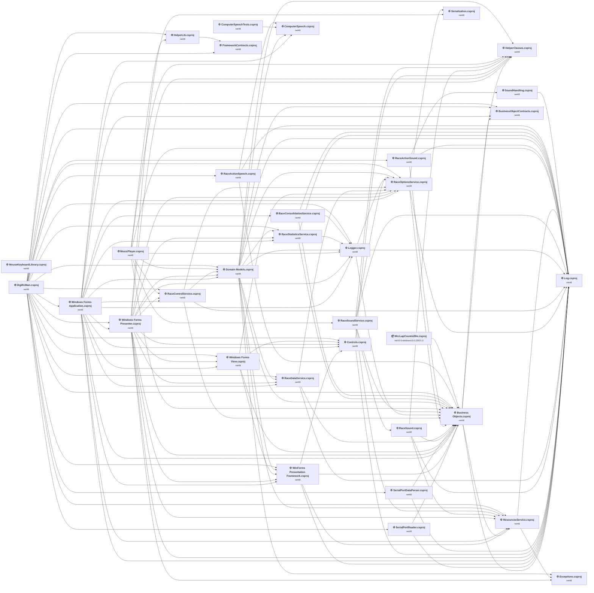

## Project Details

<a id="business-objectsbusiness-objectscsproj"></a>
### Business Objects\Business Objects.csproj

#### Project Info

- **Current Target Framework:** net48
- **Proposed Target Framework:** net10.0-windows
- **SDK-style**: False
- **Project Kind:** ClassicWinForms
- **Dependencies**: 4
- **Dependants**: 20
- **Number of Files**: 90
- **Number of Files with Incidents**: 11
- **Lines of Code**: 3758
- **Estimated LOC to modify**: 381+ (at least 10,1% of the project)

#### Dependency Graph

Legend:
📦 SDK-style project
⚙️ Classic project

```mermaid
flowchart TB
    subgraph upstream["Dependants (20)"]
        P2["<b>⚙️&nbsp;SerialPortReader.csproj</b><br/><small>net48</small>"]
        P4["<b>⚙️&nbsp;WinForms Presentation Framework.csproj</b><br/><small>net48</small>"]
        P5["<b>⚙️&nbsp;Windows Forms Application.csproj</b><br/><small>net48</small>"]
        P6["<b>⚙️&nbsp;Windows Forms Presenter.csproj</b><br/><small>net48</small>"]
        P7["<b>⚙️&nbsp;Windows Forms View.csproj</b><br/><small>net48</small>"]
        P11["<b>⚙️&nbsp;SerialPortDataParser.csproj</b><br/><small>net48</small>"]
        P12["<b>⚙️&nbsp;RaceSound.csproj</b><br/><small>net48</small>"]
        P13["<b>⚙️&nbsp;RaceDataService.csproj</b><br/><small>net48</small>"]
        P14["<b>⚙️&nbsp;RaceOptionsService.csproj</b><br/><small>net48</small>"]
        P16["<b>⚙️&nbsp;RaceControlService.csproj</b><br/><small>net48</small>"]
        P17["<b>⚙️&nbsp;Logger.csproj</b><br/><small>net48</small>"]
        P18["<b>⚙️&nbsp;RaceSoundService.csproj</b><br/><small>net48</small>"]
        P19["<b>⚙️&nbsp;MusicPlayer.csproj</b><br/><small>net48</small>"]
        P21["<b>⚙️&nbsp;RaceActionSound.csproj</b><br/><small>net48</small>"]
        P23["<b>⚙️&nbsp;Domain Models.csproj</b><br/><small>net48</small>"]
        P24["<b>⚙️&nbsp;RaceStatisticsService.csproj</b><br/><small>net48</small>"]
        P26["<b>⚙️&nbsp;RaceConsolidationService.csproj</b><br/><small>net48</small>"]
        P27["<b>⚙️&nbsp;DigiRcMan.csproj</b><br/><small>net48</small>"]
        P32["<b>⚙️&nbsp;RaceActionSpeech.csproj</b><br/><small>net48</small>"]
        P34["<b>📦&nbsp;MrcLapCounterBle.csproj</b><br/><small>net10.0-windows10.0.22621.0</small>"]
        click P2 "#serialportreaderserialportreadercsproj"
        click P4 "#presentation-frameworkwinforms-presentation-frameworkcsproj"
        click P5 "#windows-forms-applicationwindows-forms-applicationcsproj"
        click P6 "#windows-forms-presenterwindows-forms-presentercsproj"
        click P7 "#windows-forms-viewwindows-forms-viewcsproj"
        click P11 "#portdataparserserialportdataparsercsproj"
        click P12 "#racesoundracesoundcsproj"
        click P13 "#racedataserviceracedataservicecsproj"
        click P14 "#raceoptionsserviceraceoptionsservicecsproj"
        click P16 "#racecontrolserviceracecontrolservicecsproj"
        click P17 "#loggerloggercsproj"
        click P18 "#racesoundserviceracesoundservicecsproj"
        click P19 "#musicplayermusicplayercsproj"
        click P21 "#raceactionsoundraceactionsoundcsproj"
        click P23 "#domain-modelsdomain-modelscsproj"
        click P24 "#racestatisticsserviceracestatisticsservicecsproj"
        click P26 "#raceconsolidationserviceraceconsolidationservicecsproj"
        click P27 "#digislotmandigircmancsproj"
        click P32 "#raceactionspeechraceactionspeechcsproj"
        click P34 "#mrclapcounterblemrclapcounterblecsproj"
    end
    subgraph current["Business Objects.csproj"]
        MAIN["<b>⚙️&nbsp;Business Objects.csproj</b><br/><small>net48</small>"]
        click MAIN "#business-objectsbusiness-objectscsproj"
    end
    subgraph downstream["Dependencies (4"]
        P30["<b>⚙️&nbsp;BusinessObjectContracts.csproj</b><br/><small>net48</small>"]
        P15["<b>⚙️&nbsp;HelperClasses.csproj</b><br/><small>net48</small>"]
        P8["<b>⚙️&nbsp;Log.csproj</b><br/><small>net48</small>"]
        P22["<b>⚙️&nbsp;ResourcesService.csproj</b><br/><small>net48</small>"]
        click P30 "#businessobjectcontractsbusinessobjectcontractscsproj"
        click P15 "#helperclasseshelperclassescsproj"
        click P8 "#loglogcsproj"
        click P22 "#resourcesserviceresourcesservicecsproj"
    end
    P2 --> MAIN
    P4 --> MAIN
    P5 --> MAIN
    P6 --> MAIN
    P7 --> MAIN
    P11 --> MAIN
    P12 --> MAIN
    P13 --> MAIN
    P14 --> MAIN
    P16 --> MAIN
    P17 --> MAIN
    P18 --> MAIN
    P19 --> MAIN
    P21 --> MAIN
    P23 --> MAIN
    P24 --> MAIN
    P26 --> MAIN
    P27 --> MAIN
    P32 --> MAIN
    P34 --> MAIN
    MAIN --> P30
    MAIN --> P15
    MAIN --> P8
    MAIN --> P22

```

### API Compatibility

| Category | Count | Impact |
| :--- | :---: | :--- |
| 🔴 Binary Incompatible | 292 | High - Require code changes |
| 🟡 Source Incompatible | 89 | Medium - Needs re-compilation and potential conflicting API error fixing |
| 🔵 Behavioral change | 0 | Low - Behavioral changes that may require testing at runtime |
| ✅ Compatible | 6677 |  |
| ***Total APIs Analyzed*** | ***7058*** |  |

#### Project Technologies and Features

| Technology | Issues | Percentage | Migration Path |
| :--- | :---: | :---: | :--- |
| GDI+ / System.Drawing | 31 | 8,1% | System.Drawing APIs for 2D graphics, imaging, and printing that are available via NuGet package System.Drawing.Common. Note: Not recommended for server scenarios due to Windows dependencies; consider cross-platform alternatives like SkiaSharp or ImageSharp for new code. |
| Windows Forms | 292 | 76,6% | Windows Forms APIs for building Windows desktop applications with traditional Forms-based UI that are available in .NET on Windows. Enable Windows Desktop support: Option 1 (Recommended): Target net9.0-windows; Option 2: Add <UseWindowsDesktop>true</UseWindowsDesktop>; Option 3 (Legacy): Use Microsoft.NET.Sdk.WindowsDesktop SDK. |

<a id="businessobjectcontractsbusinessobjectcontractscsproj"></a>
### BusinessObjectContracts\BusinessObjectContracts.csproj

#### Project Info

- **Current Target Framework:** net48
- **Proposed Target Framework:** net10.0
- **SDK-style**: False
- **Project Kind:** ClassicClassLibrary
- **Dependencies**: 0
- **Dependants**: 4
- **Number of Files**: 2
- **Number of Files with Incidents**: 1
- **Lines of Code**: 49
- **Estimated LOC to modify**: 0+ (at least 0,0% of the project)

#### Dependency Graph

Legend:
📦 SDK-style project
⚙️ Classic project

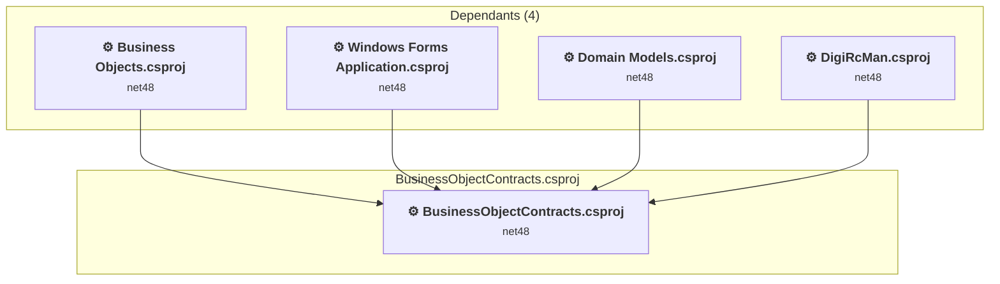

### API Compatibility

| Category | Count | Impact |
| :--- | :---: | :--- |
| 🔴 Binary Incompatible | 0 | High - Require code changes |
| 🟡 Source Incompatible | 0 | Medium - Needs re-compilation and potential conflicting API error fixing |
| 🔵 Behavioral change | 0 | Low - Behavioral changes that may require testing at runtime |
| ✅ Compatible | 32 |  |
| ***Total APIs Analyzed*** | ***32*** |  |

<a id="computerspeechcomputerspeechcsproj"></a>
### ComputerSpeech\ComputerSpeech.csproj

#### Project Info

- **Current Target Framework:** net48
- **Proposed Target Framework:** net10.0
- **SDK-style**: False
- **Project Kind:** ClassicClassLibrary
- **Dependencies**: 0
- **Dependants**: 4
- **Number of Files**: 5
- **Number of Files with Incidents**: 2
- **Lines of Code**: 166
- **Estimated LOC to modify**: 8+ (at least 4,8% of the project)

#### Dependency Graph

Legend:
📦 SDK-style project
⚙️ Classic project

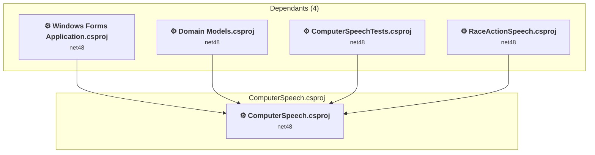

### API Compatibility

| Category | Count | Impact |
| :--- | :---: | :--- |
| 🔴 Binary Incompatible | 0 | High - Require code changes |
| 🟡 Source Incompatible | 8 | Medium - Needs re-compilation and potential conflicting API error fixing |
| 🔵 Behavioral change | 0 | Low - Behavioral changes that may require testing at runtime |
| ✅ Compatible | 109 |  |
| ***Total APIs Analyzed*** | ***117*** |  |

#### Project Technologies and Features

| Technology | Issues | Percentage | Migration Path |
| :--- | :---: | :---: | :--- |
| Speech & Voice Recognition | 8 | 100,0% | System.Speech APIs for speech recognition and synthesis that are not available in .NET Core/.NET. These Windows-specific APIs have been superseded by cloud-based services. Use Azure Cognitive Services Speech or other modern speech APIs. |

<a id="computerspeechtestscomputerspeechtestscsproj"></a>
### ComputerSpeechTests\ComputerSpeechTests.csproj

#### Project Info

- **Current Target Framework:** net48
- **Proposed Target Framework:** net10.0
- **SDK-style**: False
- **Project Kind:** ClassicClassLibrary
- **Dependencies**: 1
- **Dependants**: 0
- **Number of Files**: 2
- **Number of Files with Incidents**: 1
- **Lines of Code**: 107
- **Estimated LOC to modify**: 0+ (at least 0,0% of the project)

#### Dependency Graph

Legend:
📦 SDK-style project
⚙️ Classic project

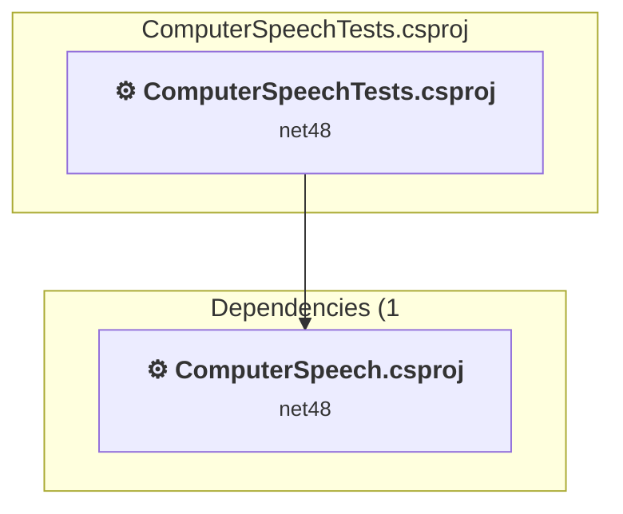

### API Compatibility

| Category | Count | Impact |
| :--- | :---: | :--- |
| 🔴 Binary Incompatible | 0 | High - Require code changes |
| 🟡 Source Incompatible | 0 | Medium - Needs re-compilation and potential conflicting API error fixing |
| 🔵 Behavioral change | 0 | Low - Behavioral changes that may require testing at runtime |
| ✅ Compatible | 68 |  |
| ***Total APIs Analyzed*** | ***68*** |  |

<a id="controlscontrolscsproj"></a>
### Controls\Controls.csproj

#### Project Info

- **Current Target Framework:** net48
- **Proposed Target Framework:** net10.0-windows
- **SDK-style**: False
- **Project Kind:** ClassicWinForms
- **Dependencies**: 2
- **Dependants**: 5
- **Number of Files**: 19
- **Number of Files with Incidents**: 15
- **Lines of Code**: 1843
- **Estimated LOC to modify**: 805+ (at least 43,7% of the project)

#### Dependency Graph

Legend:
📦 SDK-style project
⚙️ Classic project

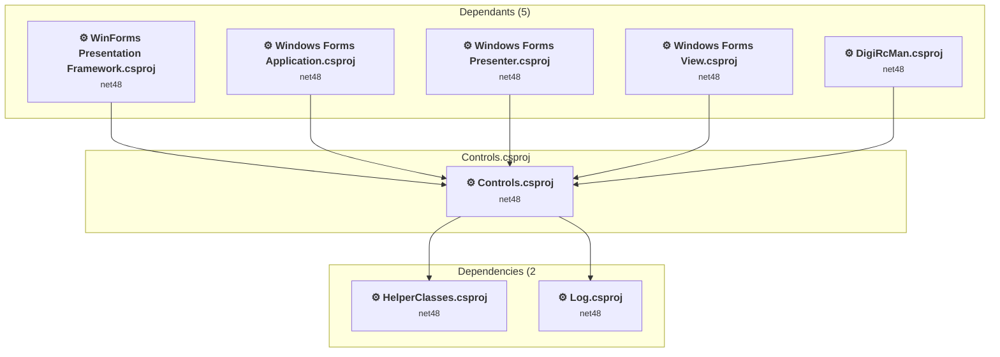

### API Compatibility

| Category | Count | Impact |
| :--- | :---: | :--- |
| 🔴 Binary Incompatible | 437 | High - Require code changes |
| 🟡 Source Incompatible | 368 | Medium - Needs re-compilation and potential conflicting API error fixing |
| 🔵 Behavioral change | 0 | Low - Behavioral changes that may require testing at runtime |
| ✅ Compatible | 1296 |  |
| ***Total APIs Analyzed*** | ***2101*** |  |

#### Project Technologies and Features

| Technology | Issues | Percentage | Migration Path |
| :--- | :---: | :---: | :--- |
| Windows Forms Legacy Controls | 84 | 10,4% | Legacy Windows Forms controls that have been removed from .NET Core/5+ including StatusBar, DataGrid, ContextMenu, MainMenu, MenuItem, and ToolBar. These controls were replaced by more modern alternatives. Use ToolStrip, MenuStrip, ContextMenuStrip, and DataGridView instead. |
| GDI+ / System.Drawing | 368 | 45,7% | System.Drawing APIs for 2D graphics, imaging, and printing that are available via NuGet package System.Drawing.Common. Note: Not recommended for server scenarios due to Windows dependencies; consider cross-platform alternatives like SkiaSharp or ImageSharp for new code. |
| Windows Forms | 428 | 53,2% | Windows Forms APIs for building Windows desktop applications with traditional Forms-based UI that are available in .NET on Windows. Enable Windows Desktop support: Option 1 (Recommended): Target net9.0-windows; Option 2: Add <UseWindowsDesktop>true</UseWindowsDesktop>; Option 3 (Legacy): Use Microsoft.NET.Sdk.WindowsDesktop SDK. |

<a id="digislotmandigircmancsproj"></a>
### DigiSlotMan\DigiRcMan.csproj

#### Project Info

- **Current Target Framework:** net48
- **Proposed Target Framework:** net10.0-windows
- **SDK-style**: False
- **Project Kind:** ClassicWinForms
- **Dependencies**: 21
- **Dependants**: 0
- **Number of Files**: 44
- **Number of Files with Incidents**: 4
- **Lines of Code**: 1056
- **Estimated LOC to modify**: 34+ (at least 3,2% of the project)

#### Dependency Graph

Legend:
📦 SDK-style project
⚙️ Classic project

```mermaid
flowchart TB
    subgraph current["DigiRcMan.csproj"]
        MAIN["<b>⚙️&nbsp;DigiRcMan.csproj</b><br/><small>net48</small>"]
        click MAIN "#digislotmandigircmancsproj"
    end
    subgraph downstream["Dependencies (21"]
        P1["<b>⚙️&nbsp;Business Objects.csproj</b><br/><small>net48</small>"]
        P30["<b>⚙️&nbsp;BusinessObjectContracts.csproj</b><br/><small>net48</small>"]
        P10["<b>⚙️&nbsp;Controls.csproj</b><br/><small>net48</small>"]
        P23["<b>⚙️&nbsp;Domain Models.csproj</b><br/><small>net48</small>"]
        P28["<b>⚙️&nbsp;FrameworkContracts.csproj</b><br/><small>net48</small>"]
        P29["<b>⚙️&nbsp;HelperLib.csproj</b><br/><small>net48</small>"]
        P17["<b>⚙️&nbsp;Logger.csproj</b><br/><small>net48</small>"]
        P8["<b>⚙️&nbsp;Log.csproj</b><br/><small>net48</small>"]
        P11["<b>⚙️&nbsp;SerialPortDataParser.csproj</b><br/><small>net48</small>"]
        P4["<b>⚙️&nbsp;WinForms Presentation Framework.csproj</b><br/><small>net48</small>"]
        P21["<b>⚙️&nbsp;RaceActionSound.csproj</b><br/><small>net48</small>"]
        P32["<b>⚙️&nbsp;RaceActionSpeech.csproj</b><br/><small>net48</small>"]
        P16["<b>⚙️&nbsp;RaceControlService.csproj</b><br/><small>net48</small>"]
        P13["<b>⚙️&nbsp;RaceDataService.csproj</b><br/><small>net48</small>"]
        P14["<b>⚙️&nbsp;RaceOptionsService.csproj</b><br/><small>net48</small>"]
        P24["<b>⚙️&nbsp;RaceStatisticsService.csproj</b><br/><small>net48</small>"]
        P22["<b>⚙️&nbsp;ResourcesService.csproj</b><br/><small>net48</small>"]
        P2["<b>⚙️&nbsp;SerialPortReader.csproj</b><br/><small>net48</small>"]
        P5["<b>⚙️&nbsp;Windows Forms Application.csproj</b><br/><small>net48</small>"]
        P6["<b>⚙️&nbsp;Windows Forms Presenter.csproj</b><br/><small>net48</small>"]
        P7["<b>⚙️&nbsp;Windows Forms View.csproj</b><br/><small>net48</small>"]
        click P1 "#business-objectsbusiness-objectscsproj"
        click P30 "#businessobjectcontractsbusinessobjectcontractscsproj"
        click P10 "#controlscontrolscsproj"
        click P23 "#domain-modelsdomain-modelscsproj"
        click P28 "#frameworkcontractsframeworkcontractscsproj"
        click P29 "#helperlibhelperlibcsproj"
        click P17 "#loggerloggercsproj"
        click P8 "#loglogcsproj"
        click P11 "#portdataparserserialportdataparsercsproj"
        click P4 "#presentation-frameworkwinforms-presentation-frameworkcsproj"
        click P21 "#raceactionsoundraceactionsoundcsproj"
        click P32 "#raceactionspeechraceactionspeechcsproj"
        click P16 "#racecontrolserviceracecontrolservicecsproj"
        click P13 "#racedataserviceracedataservicecsproj"
        click P14 "#raceoptionsserviceraceoptionsservicecsproj"
        click P24 "#racestatisticsserviceracestatisticsservicecsproj"
        click P22 "#resourcesserviceresourcesservicecsproj"
        click P2 "#serialportreaderserialportreadercsproj"
        click P5 "#windows-forms-applicationwindows-forms-applicationcsproj"
        click P6 "#windows-forms-presenterwindows-forms-presentercsproj"
        click P7 "#windows-forms-viewwindows-forms-viewcsproj"
    end
    MAIN --> P1
    MAIN --> P30
    MAIN --> P10
    MAIN --> P23
    MAIN --> P28
    MAIN --> P29
    MAIN --> P17
    MAIN --> P8
    MAIN --> P11
    MAIN --> P4
    MAIN --> P21
    MAIN --> P32
    MAIN --> P16
    MAIN --> P13
    MAIN --> P14
    MAIN --> P24
    MAIN --> P22
    MAIN --> P2
    MAIN --> P5
    MAIN --> P6
    MAIN --> P7

```

### API Compatibility

| Category | Count | Impact |
| :--- | :---: | :--- |
| 🔴 Binary Incompatible | 23 | High - Require code changes |
| 🟡 Source Incompatible | 11 | Medium - Needs re-compilation and potential conflicting API error fixing |
| 🔵 Behavioral change | 0 | Low - Behavioral changes that may require testing at runtime |
| ✅ Compatible | 567 |  |
| ***Total APIs Analyzed*** | ***601*** |  |

#### Project Technologies and Features

| Technology | Issues | Percentage | Migration Path |
| :--- | :---: | :---: | :--- |
| Windows Forms | 14 | 41,2% | Windows Forms APIs for building Windows desktop applications with traditional Forms-based UI that are available in .NET on Windows. Enable Windows Desktop support: Option 1 (Recommended): Target net9.0-windows; Option 2: Add <UseWindowsDesktop>true</UseWindowsDesktop>; Option 3 (Legacy): Use Microsoft.NET.Sdk.WindowsDesktop SDK. |
| Legacy Configuration System | 11 | 32,4% | Legacy XML-based configuration system (app.config/web.config) that has been replaced by a more flexible configuration model in .NET Core. The old system was rigid and XML-based. Migrate to Microsoft.Extensions.Configuration with JSON/environment variables; use System.Configuration.ConfigurationManager NuGet package as interim bridge if needed. |

<a id="domain-modelsdomain-modelscsproj"></a>
### Domain Models\Domain Models.csproj

#### Project Info

- **Current Target Framework:** net48
- **Proposed Target Framework:** net10.0-windows
- **SDK-style**: False
- **Project Kind:** ClassicWinForms
- **Dependencies**: 12
- **Dependants**: 5
- **Number of Files**: 28
- **Number of Files with Incidents**: 4
- **Lines of Code**: 4008
- **Estimated LOC to modify**: 21+ (at least 0,5% of the project)

#### Dependency Graph

Legend:
📦 SDK-style project
⚙️ Classic project

```mermaid
flowchart TB
    subgraph upstream["Dependants (5)"]
        P5["<b>⚙️&nbsp;Windows Forms Application.csproj</b><br/><small>net48</small>"]
        P6["<b>⚙️&nbsp;Windows Forms Presenter.csproj</b><br/><small>net48</small>"]
        P16["<b>⚙️&nbsp;RaceControlService.csproj</b><br/><small>net48</small>"]
        P19["<b>⚙️&nbsp;MusicPlayer.csproj</b><br/><small>net48</small>"]
        P27["<b>⚙️&nbsp;DigiRcMan.csproj</b><br/><small>net48</small>"]
        click P5 "#windows-forms-applicationwindows-forms-applicationcsproj"
        click P6 "#windows-forms-presenterwindows-forms-presentercsproj"
        click P16 "#racecontrolserviceracecontrolservicecsproj"
        click P19 "#musicplayermusicplayercsproj"
        click P27 "#digislotmandigircmancsproj"
    end
    subgraph current["Domain Models.csproj"]
        MAIN["<b>⚙️&nbsp;Domain Models.csproj</b><br/><small>net48</small>"]
        click MAIN "#domain-modelsdomain-modelscsproj"
    end
    subgraph downstream["Dependencies (12"]
        P1["<b>⚙️&nbsp;Business Objects.csproj</b><br/><small>net48</small>"]
        P30["<b>⚙️&nbsp;BusinessObjectContracts.csproj</b><br/><small>net48</small>"]
        P20["<b>⚙️&nbsp;ComputerSpeech.csproj</b><br/><small>net48</small>"]
        P3["<b>⚙️&nbsp;Exceptions.csproj</b><br/><small>net48</small>"]
        P15["<b>⚙️&nbsp;HelperClasses.csproj</b><br/><small>net48</small>"]
        P17["<b>⚙️&nbsp;Logger.csproj</b><br/><small>net48</small>"]
        P8["<b>⚙️&nbsp;Log.csproj</b><br/><small>net48</small>"]
        P4["<b>⚙️&nbsp;WinForms Presentation Framework.csproj</b><br/><small>net48</small>"]
        P13["<b>⚙️&nbsp;RaceDataService.csproj</b><br/><small>net48</small>"]
        P14["<b>⚙️&nbsp;RaceOptionsService.csproj</b><br/><small>net48</small>"]
        P24["<b>⚙️&nbsp;RaceStatisticsService.csproj</b><br/><small>net48</small>"]
        P22["<b>⚙️&nbsp;ResourcesService.csproj</b><br/><small>net48</small>"]
        click P1 "#business-objectsbusiness-objectscsproj"
        click P30 "#businessobjectcontractsbusinessobjectcontractscsproj"
        click P20 "#computerspeechcomputerspeechcsproj"
        click P3 "#exceptionsexceptionscsproj"
        click P15 "#helperclasseshelperclassescsproj"
        click P17 "#loggerloggercsproj"
        click P8 "#loglogcsproj"
        click P4 "#presentation-frameworkwinforms-presentation-frameworkcsproj"
        click P13 "#racedataserviceracedataservicecsproj"
        click P14 "#raceoptionsserviceraceoptionsservicecsproj"
        click P24 "#racestatisticsserviceracestatisticsservicecsproj"
        click P22 "#resourcesserviceresourcesservicecsproj"
    end
    P5 --> MAIN
    P6 --> MAIN
    P16 --> MAIN
    P19 --> MAIN
    P27 --> MAIN
    MAIN --> P1
    MAIN --> P30
    MAIN --> P20
    MAIN --> P3
    MAIN --> P15
    MAIN --> P17
    MAIN --> P8
    MAIN --> P4
    MAIN --> P13
    MAIN --> P14
    MAIN --> P24
    MAIN --> P22

```

### API Compatibility

| Category | Count | Impact |
| :--- | :---: | :--- |
| 🔴 Binary Incompatible | 9 | High - Require code changes |
| 🟡 Source Incompatible | 12 | Medium - Needs re-compilation and potential conflicting API error fixing |
| 🔵 Behavioral change | 0 | Low - Behavioral changes that may require testing at runtime |
| ✅ Compatible | 5763 |  |
| ***Total APIs Analyzed*** | ***5784*** |  |

#### Project Technologies and Features

| Technology | Issues | Percentage | Migration Path |
| :--- | :---: | :---: | :--- |
| Windows Forms | 9 | 42,9% | Windows Forms APIs for building Windows desktop applications with traditional Forms-based UI that are available in .NET on Windows. Enable Windows Desktop support: Option 1 (Recommended): Target net9.0-windows; Option 2: Add <UseWindowsDesktop>true</UseWindowsDesktop>; Option 3 (Legacy): Use Microsoft.NET.Sdk.WindowsDesktop SDK. |
| GDI+ / System.Drawing | 12 | 57,1% | System.Drawing APIs for 2D graphics, imaging, and printing that are available via NuGet package System.Drawing.Common. Note: Not recommended for server scenarios due to Windows dependencies; consider cross-platform alternatives like SkiaSharp or ImageSharp for new code. |

<a id="exceptionsexceptionscsproj"></a>
### Exceptions\Exceptions.csproj

#### Project Info

- **Current Target Framework:** net48
- **Proposed Target Framework:** net10.0
- **SDK-style**: False
- **Project Kind:** ClassicClassLibrary
- **Dependencies**: 0
- **Dependants**: 3
- **Number of Files**: 2
- **Number of Files with Incidents**: 1
- **Lines of Code**: 45
- **Estimated LOC to modify**: 0+ (at least 0,0% of the project)

#### Dependency Graph

Legend:
📦 SDK-style project
⚙️ Classic project

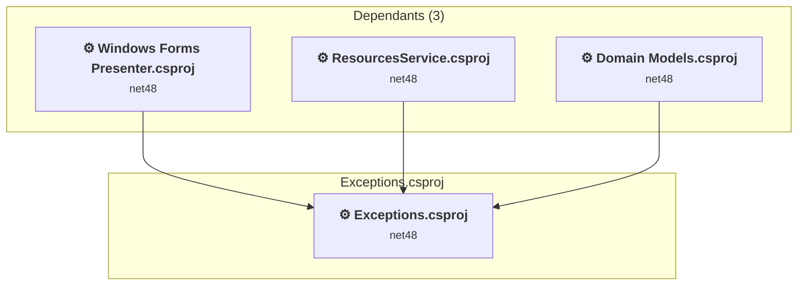

### API Compatibility

| Category | Count | Impact |
| :--- | :---: | :--- |
| 🔴 Binary Incompatible | 0 | High - Require code changes |
| 🟡 Source Incompatible | 0 | Medium - Needs re-compilation and potential conflicting API error fixing |
| 🔵 Behavioral change | 0 | Low - Behavioral changes that may require testing at runtime |
| ✅ Compatible | 9 |  |
| ***Total APIs Analyzed*** | ***9*** |  |

<a id="frameworkcontractsframeworkcontractscsproj"></a>
### FrameworkContracts\FrameworkContracts.csproj

#### Project Info

- **Current Target Framework:** net48
- **Proposed Target Framework:** net10.0
- **SDK-style**: False
- **Project Kind:** ClassicClassLibrary
- **Dependencies**: 0
- **Dependants**: 2
- **Number of Files**: 6
- **Number of Files with Incidents**: 1
- **Lines of Code**: 85
- **Estimated LOC to modify**: 0+ (at least 0,0% of the project)

#### Dependency Graph

Legend:
📦 SDK-style project
⚙️ Classic project

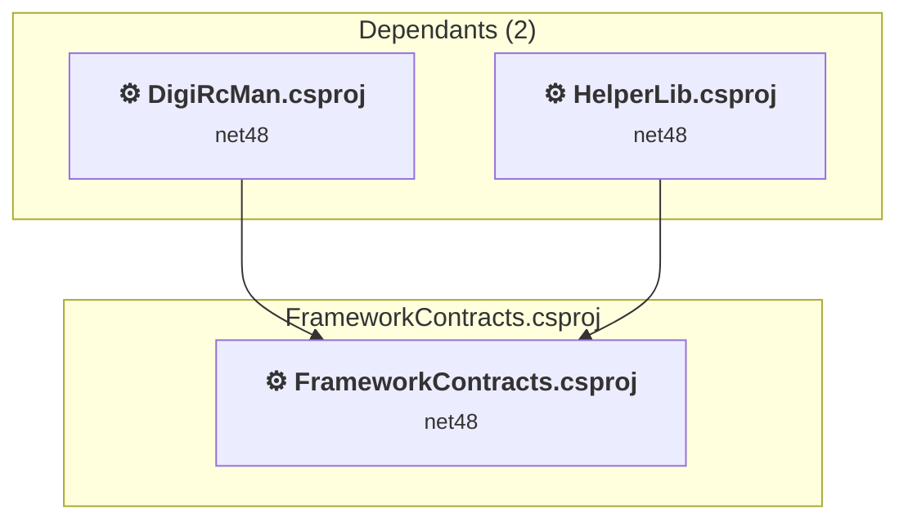

### API Compatibility

| Category | Count | Impact |
| :--- | :---: | :--- |
| 🔴 Binary Incompatible | 0 | High - Require code changes |
| 🟡 Source Incompatible | 0 | Medium - Needs re-compilation and potential conflicting API error fixing |
| 🔵 Behavioral change | 0 | Low - Behavioral changes that may require testing at runtime |
| ✅ Compatible | 25 |  |
| ***Total APIs Analyzed*** | ***25*** |  |

<a id="helperclasseshelperclassescsproj"></a>
### HelperClasses\HelperClasses.csproj

#### Project Info

- **Current Target Framework:** net48
- **Proposed Target Framework:** net10.0-windows
- **SDK-style**: False
- **Project Kind:** ClassicWinForms
- **Dependencies**: 0
- **Dependants**: 8
- **Number of Files**: 5
- **Number of Files with Incidents**: 3
- **Lines of Code**: 744
- **Estimated LOC to modify**: 41+ (at least 5,5% of the project)

#### Dependency Graph

Legend:
📦 SDK-style project
⚙️ Classic project

```mermaid
flowchart TB
    subgraph upstream["Dependants (8)"]
        P1["<b>⚙️&nbsp;Business Objects.csproj</b><br/><small>net48</small>"]
        P5["<b>⚙️&nbsp;Windows Forms Application.csproj</b><br/><small>net48</small>"]
        P6["<b>⚙️&nbsp;Windows Forms Presenter.csproj</b><br/><small>net48</small>"]
        P10["<b>⚙️&nbsp;Controls.csproj</b><br/><small>net48</small>"]
        P12["<b>⚙️&nbsp;RaceSound.csproj</b><br/><small>net48</small>"]
        P18["<b>⚙️&nbsp;RaceSoundService.csproj</b><br/><small>net48</small>"]
        P19["<b>⚙️&nbsp;MusicPlayer.csproj</b><br/><small>net48</small>"]
        P23["<b>⚙️&nbsp;Domain Models.csproj</b><br/><small>net48</small>"]
        click P1 "#business-objectsbusiness-objectscsproj"
        click P5 "#windows-forms-applicationwindows-forms-applicationcsproj"
        click P6 "#windows-forms-presenterwindows-forms-presentercsproj"
        click P10 "#controlscontrolscsproj"
        click P12 "#racesoundracesoundcsproj"
        click P18 "#racesoundserviceracesoundservicecsproj"
        click P19 "#musicplayermusicplayercsproj"
        click P23 "#domain-modelsdomain-modelscsproj"
    end
    subgraph current["HelperClasses.csproj"]
        MAIN["<b>⚙️&nbsp;HelperClasses.csproj</b><br/><small>net48</small>"]
        click MAIN "#helperclasseshelperclassescsproj"
    end
    P1 --> MAIN
    P5 --> MAIN
    P6 --> MAIN
    P10 --> MAIN
    P12 --> MAIN
    P18 --> MAIN
    P19 --> MAIN
    P23 --> MAIN

```

### API Compatibility

| Category | Count | Impact |
| :--- | :---: | :--- |
| 🔴 Binary Incompatible | 32 | High - Require code changes |
| 🟡 Source Incompatible | 8 | Medium - Needs re-compilation and potential conflicting API error fixing |
| 🔵 Behavioral change | 1 | Low - Behavioral changes that may require testing at runtime |
| ✅ Compatible | 746 |  |
| ***Total APIs Analyzed*** | ***787*** |  |

#### Project Technologies and Features

| Technology | Issues | Percentage | Migration Path |
| :--- | :---: | :---: | :--- |
| Deprecated Remoting & Serialization | 2 | 4,9% | Legacy .NET Remoting, BinaryFormatter, and related serialization APIs that are deprecated and removed for security reasons. Remoting provided distributed object communication but had significant security vulnerabilities. Migrate to gRPC, HTTP APIs, or modern serialization (System.Text.Json, protobuf). |
| Windows Forms | 32 | 78,0% | Windows Forms APIs for building Windows desktop applications with traditional Forms-based UI that are available in .NET on Windows. Enable Windows Desktop support: Option 1 (Recommended): Target net9.0-windows; Option 2: Add <UseWindowsDesktop>true</UseWindowsDesktop>; Option 3 (Legacy): Use Microsoft.NET.Sdk.WindowsDesktop SDK. |
| GDI+ / System.Drawing | 6 | 14,6% | System.Drawing APIs for 2D graphics, imaging, and printing that are available via NuGet package System.Drawing.Common. Note: Not recommended for server scenarios due to Windows dependencies; consider cross-platform alternatives like SkiaSharp or ImageSharp for new code. |

<a id="helperlibhelperlibcsproj"></a>
### HelperLib\HelperLib.csproj

#### Project Info

- **Current Target Framework:** net48
- **Proposed Target Framework:** net10.0-windows
- **SDK-style**: False
- **Project Kind:** ClassicWinForms
- **Dependencies**: 1
- **Dependants**: 2
- **Number of Files**: 6
- **Number of Files with Incidents**: 3
- **Lines of Code**: 487
- **Estimated LOC to modify**: 13+ (at least 2,7% of the project)

#### Dependency Graph

Legend:
📦 SDK-style project
⚙️ Classic project

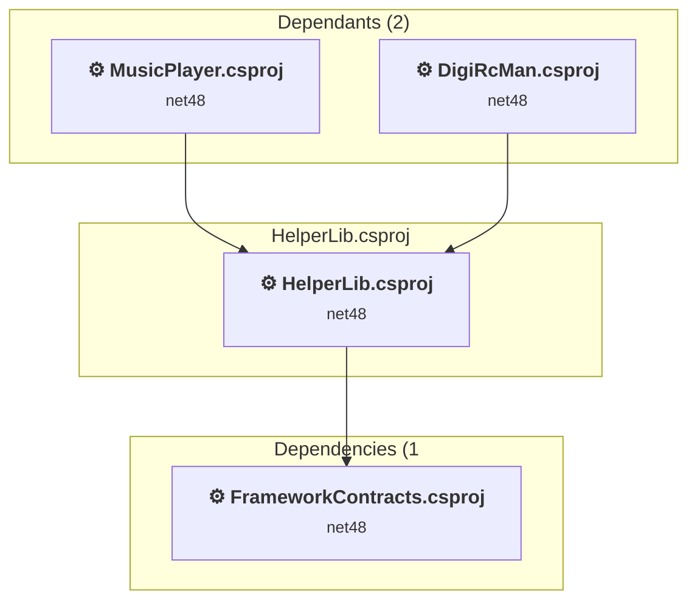

### API Compatibility

| Category | Count | Impact |
| :--- | :---: | :--- |
| 🔴 Binary Incompatible | 4 | High - Require code changes |
| 🟡 Source Incompatible | 2 | Medium - Needs re-compilation and potential conflicting API error fixing |
| 🔵 Behavioral change | 7 | Low - Behavioral changes that may require testing at runtime |
| ✅ Compatible | 265 |  |
| ***Total APIs Analyzed*** | ***278*** |  |

#### Project Technologies and Features

| Technology | Issues | Percentage | Migration Path |
| :--- | :---: | :---: | :--- |
| Deprecated Remoting & Serialization | 2 | 15,4% | Legacy .NET Remoting, BinaryFormatter, and related serialization APIs that are deprecated and removed for security reasons. Remoting provided distributed object communication but had significant security vulnerabilities. Migrate to gRPC, HTTP APIs, or modern serialization (System.Text.Json, protobuf). |
| Windows Forms | 4 | 30,8% | Windows Forms APIs for building Windows desktop applications with traditional Forms-based UI that are available in .NET on Windows. Enable Windows Desktop support: Option 1 (Recommended): Target net9.0-windows; Option 2: Add <UseWindowsDesktop>true</UseWindowsDesktop>; Option 3 (Legacy): Use Microsoft.NET.Sdk.WindowsDesktop SDK. |

<a id="loglogcsproj"></a>
### Log\Log.csproj

#### Project Info

- **Current Target Framework:** net48
- **Proposed Target Framework:** net10.0-windows
- **SDK-style**: False
- **Project Kind:** ClassicWinForms
- **Dependencies**: 0
- **Dependants**: 22
- **Number of Files**: 7
- **Number of Files with Incidents**: 4
- **Lines of Code**: 244
- **Estimated LOC to modify**: 51+ (at least 20,9% of the project)

#### Dependency Graph

Legend:
📦 SDK-style project
⚙️ Classic project

```mermaid
flowchart TB
    subgraph upstream["Dependants (22)"]
        P1["<b>⚙️&nbsp;Business Objects.csproj</b><br/><small>net48</small>"]
        P2["<b>⚙️&nbsp;SerialPortReader.csproj</b><br/><small>net48</small>"]
        P4["<b>⚙️&nbsp;WinForms Presentation Framework.csproj</b><br/><small>net48</small>"]
        P5["<b>⚙️&nbsp;Windows Forms Application.csproj</b><br/><small>net48</small>"]
        P6["<b>⚙️&nbsp;Windows Forms Presenter.csproj</b><br/><small>net48</small>"]
        P10["<b>⚙️&nbsp;Controls.csproj</b><br/><small>net48</small>"]
        P11["<b>⚙️&nbsp;SerialPortDataParser.csproj</b><br/><small>net48</small>"]
        P12["<b>⚙️&nbsp;RaceSound.csproj</b><br/><small>net48</small>"]
        P13["<b>⚙️&nbsp;RaceDataService.csproj</b><br/><small>net48</small>"]
        P14["<b>⚙️&nbsp;RaceOptionsService.csproj</b><br/><small>net48</small>"]
        P16["<b>⚙️&nbsp;RaceControlService.csproj</b><br/><small>net48</small>"]
        P17["<b>⚙️&nbsp;Logger.csproj</b><br/><small>net48</small>"]
        P18["<b>⚙️&nbsp;RaceSoundService.csproj</b><br/><small>net48</small>"]
        P19["<b>⚙️&nbsp;MusicPlayer.csproj</b><br/><small>net48</small>"]
        P21["<b>⚙️&nbsp;RaceActionSound.csproj</b><br/><small>net48</small>"]
        P22["<b>⚙️&nbsp;ResourcesService.csproj</b><br/><small>net48</small>"]
        P23["<b>⚙️&nbsp;Domain Models.csproj</b><br/><small>net48</small>"]
        P24["<b>⚙️&nbsp;RaceStatisticsService.csproj</b><br/><small>net48</small>"]
        P26["<b>⚙️&nbsp;RaceConsolidationService.csproj</b><br/><small>net48</small>"]
        P27["<b>⚙️&nbsp;DigiRcMan.csproj</b><br/><small>net48</small>"]
        P32["<b>⚙️&nbsp;RaceActionSpeech.csproj</b><br/><small>net48</small>"]
        P33["<b>⚙️&nbsp;SoundHandling.csproj</b><br/><small>net48</small>"]
        click P1 "#business-objectsbusiness-objectscsproj"
        click P2 "#serialportreaderserialportreadercsproj"
        click P4 "#presentation-frameworkwinforms-presentation-frameworkcsproj"
        click P5 "#windows-forms-applicationwindows-forms-applicationcsproj"
        click P6 "#windows-forms-presenterwindows-forms-presentercsproj"
        click P10 "#controlscontrolscsproj"
        click P11 "#portdataparserserialportdataparsercsproj"
        click P12 "#racesoundracesoundcsproj"
        click P13 "#racedataserviceracedataservicecsproj"
        click P14 "#raceoptionsserviceraceoptionsservicecsproj"
        click P16 "#racecontrolserviceracecontrolservicecsproj"
        click P17 "#loggerloggercsproj"
        click P18 "#racesoundserviceracesoundservicecsproj"
        click P19 "#musicplayermusicplayercsproj"
        click P21 "#raceactionsoundraceactionsoundcsproj"
        click P22 "#resourcesserviceresourcesservicecsproj"
        click P23 "#domain-modelsdomain-modelscsproj"
        click P24 "#racestatisticsserviceracestatisticsservicecsproj"
        click P26 "#raceconsolidationserviceraceconsolidationservicecsproj"
        click P27 "#digislotmandigircmancsproj"
        click P32 "#raceactionspeechraceactionspeechcsproj"
        click P33 "#soundhandlingsoundhandlingcsproj"
    end
    subgraph current["Log.csproj"]
        MAIN["<b>⚙️&nbsp;Log.csproj</b><br/><small>net48</small>"]
        click MAIN "#loglogcsproj"
    end
    P1 --> MAIN
    P2 --> MAIN
    P4 --> MAIN
    P5 --> MAIN
    P6 --> MAIN
    P10 --> MAIN
    P11 --> MAIN
    P12 --> MAIN
    P13 --> MAIN
    P14 --> MAIN
    P16 --> MAIN
    P17 --> MAIN
    P18 --> MAIN
    P19 --> MAIN
    P21 --> MAIN
    P22 --> MAIN
    P23 --> MAIN
    P24 --> MAIN
    P26 --> MAIN
    P27 --> MAIN
    P32 --> MAIN
    P33 --> MAIN

```

### API Compatibility

| Category | Count | Impact |
| :--- | :---: | :--- |
| 🔴 Binary Incompatible | 51 | High - Require code changes |
| 🟡 Source Incompatible | 0 | Medium - Needs re-compilation and potential conflicting API error fixing |
| 🔵 Behavioral change | 0 | Low - Behavioral changes that may require testing at runtime |
| ✅ Compatible | 241 |  |
| ***Total APIs Analyzed*** | ***292*** |  |

#### Project Technologies and Features

| Technology | Issues | Percentage | Migration Path |
| :--- | :---: | :---: | :--- |
| Windows Forms | 51 | 100,0% | Windows Forms APIs for building Windows desktop applications with traditional Forms-based UI that are available in .NET on Windows. Enable Windows Desktop support: Option 1 (Recommended): Target net9.0-windows; Option 2: Add <UseWindowsDesktop>true</UseWindowsDesktop>; Option 3 (Legacy): Use Microsoft.NET.Sdk.WindowsDesktop SDK. |

<a id="loggerloggercsproj"></a>
### Logger\Logger.csproj

#### Project Info

- **Current Target Framework:** net48
- **Proposed Target Framework:** net10.0
- **SDK-style**: False
- **Project Kind:** ClassicClassLibrary
- **Dependencies**: 3
- **Dependants**: 7
- **Number of Files**: 8
- **Number of Files with Incidents**: 1
- **Lines of Code**: 955
- **Estimated LOC to modify**: 0+ (at least 0,0% of the project)

#### Dependency Graph

Legend:
📦 SDK-style project
⚙️ Classic project

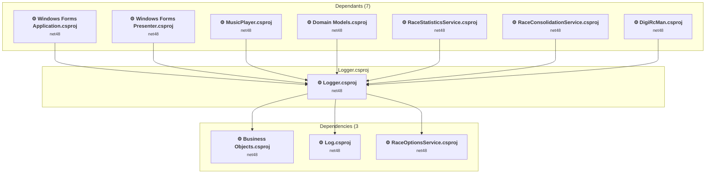

### API Compatibility

| Category | Count | Impact |
| :--- | :---: | :--- |
| 🔴 Binary Incompatible | 0 | High - Require code changes |
| 🟡 Source Incompatible | 0 | Medium - Needs re-compilation and potential conflicting API error fixing |
| 🔵 Behavioral change | 0 | Low - Behavioral changes that may require testing at runtime |
| ✅ Compatible | 1033 |  |
| ***Total APIs Analyzed*** | ***1033*** |  |

<a id="mousekeyboardlibrarymousekeyboardlibrarycsproj"></a>
### MouseKeyboardLibrary\MouseKeyboardLibrary.csproj

#### Project Info

- **Current Target Framework:** net48
- **Proposed Target Framework:** net10.0-windows
- **SDK-style**: False
- **Project Kind:** ClassicWinForms
- **Dependencies**: 0
- **Dependants**: 0
- **Number of Files**: 6
- **Number of Files with Incidents**: 6
- **Lines of Code**: 922
- **Estimated LOC to modify**: 240+ (at least 26,0% of the project)

#### Dependency Graph

Legend:
📦 SDK-style project
⚙️ Classic project

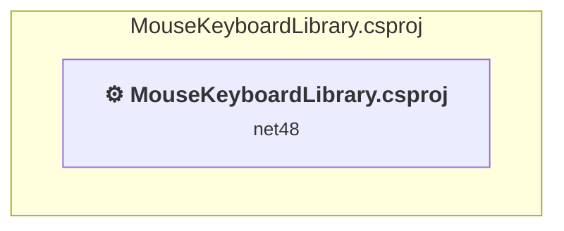

### API Compatibility

| Category | Count | Impact |
| :--- | :---: | :--- |
| 🔴 Binary Incompatible | 240 | High - Require code changes |
| 🟡 Source Incompatible | 0 | Medium - Needs re-compilation and potential conflicting API error fixing |
| 🔵 Behavioral change | 0 | Low - Behavioral changes that may require testing at runtime |
| ✅ Compatible | 353 |  |
| ***Total APIs Analyzed*** | ***593*** |  |

#### Project Technologies and Features

| Technology | Issues | Percentage | Migration Path |
| :--- | :---: | :---: | :--- |
| Windows Forms | 240 | 100,0% | Windows Forms APIs for building Windows desktop applications with traditional Forms-based UI that are available in .NET on Windows. Enable Windows Desktop support: Option 1 (Recommended): Target net9.0-windows; Option 2: Add <UseWindowsDesktop>true</UseWindowsDesktop>; Option 3 (Legacy): Use Microsoft.NET.Sdk.WindowsDesktop SDK. |

<a id="mrclapcounterblemrclapcounterblecsproj"></a>
### MrcLapCounterBle\MrcLapCounterBle.csproj

#### Project Info

- **Current Target Framework:** net10.0-windows10.0.22621.0✅
- **SDK-style**: True
- **Project Kind:** Wpf
- **Dependencies**: 1
- **Dependants**: 0
- **Number of Files**: 4
- **Lines of Code**: 457
- **Estimated LOC to modify**: 0+ (at least 0,0% of the project)

#### Dependency Graph

Legend:
📦 SDK-style project
⚙️ Classic project

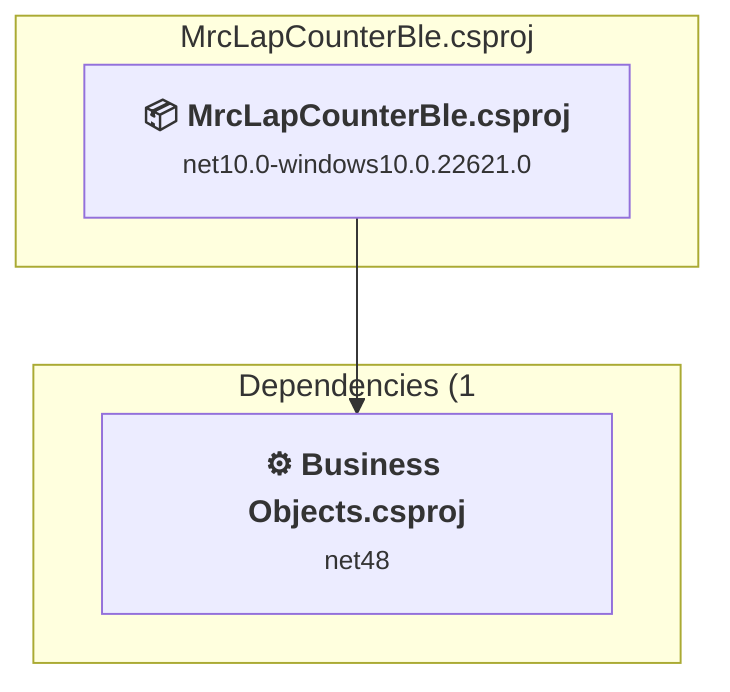

### API Compatibility

| Category | Count | Impact |
| :--- | :---: | :--- |
| 🔴 Binary Incompatible | 0 | High - Require code changes |
| 🟡 Source Incompatible | 0 | Medium - Needs re-compilation and potential conflicting API error fixing |
| 🔵 Behavioral change | 0 | Low - Behavioral changes that may require testing at runtime |
| ✅ Compatible | 0 |  |
| ***Total APIs Analyzed*** | ***0*** |  |

<a id="musicplayermusicplayercsproj"></a>
### MusicPlayer\MusicPlayer.csproj

#### Project Info

- **Current Target Framework:** net48
- **Proposed Target Framework:** net10.0
- **SDK-style**: False
- **Project Kind:** ClassicClassLibrary
- **Dependencies**: 8
- **Dependants**: 0
- **Number of Files**: 5
- **Number of Files with Incidents**: 2
- **Lines of Code**: 642
- **Estimated LOC to modify**: 1+ (at least 0,2% of the project)

#### Dependency Graph

Legend:
📦 SDK-style project
⚙️ Classic project

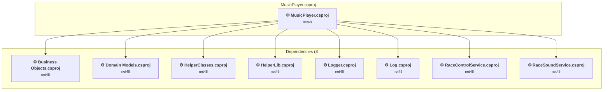

### API Compatibility

| Category | Count | Impact |
| :--- | :---: | :--- |
| 🔴 Binary Incompatible | 0 | High - Require code changes |
| 🟡 Source Incompatible | 1 | Medium - Needs re-compilation and potential conflicting API error fixing |
| 🔵 Behavioral change | 0 | Low - Behavioral changes that may require testing at runtime |
| ✅ Compatible | 447 |  |
| ***Total APIs Analyzed*** | ***448*** |  |

<a id="portdataparserserialportdataparsercsproj"></a>
### PortDataParser\SerialPortDataParser.csproj

#### Project Info

- **Current Target Framework:** net48
- **Proposed Target Framework:** net10.0
- **SDK-style**: False
- **Project Kind:** ClassicClassLibrary
- **Dependencies**: 2
- **Dependants**: 1
- **Number of Files**: 4
- **Number of Files with Incidents**: 1
- **Lines of Code**: 456
- **Estimated LOC to modify**: 0+ (at least 0,0% of the project)

#### Dependency Graph

Legend:
📦 SDK-style project
⚙️ Classic project

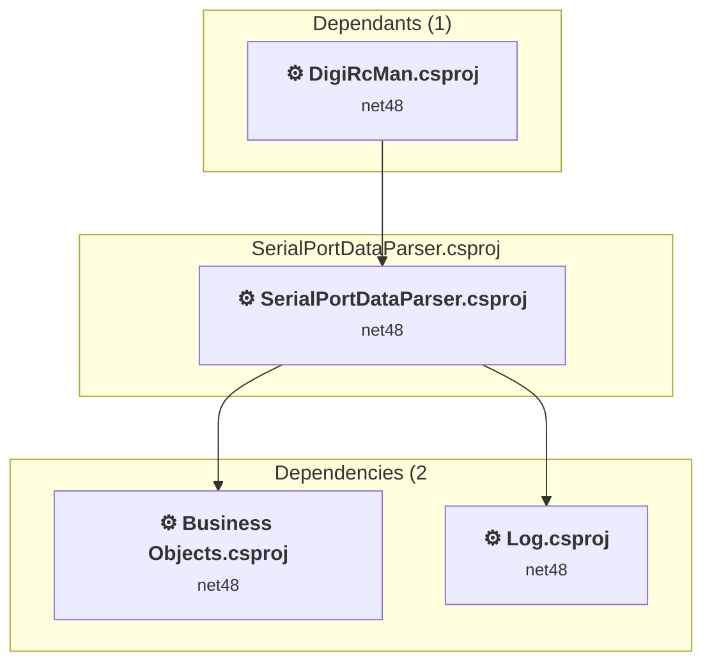

### API Compatibility

| Category | Count | Impact |
| :--- | :---: | :--- |
| 🔴 Binary Incompatible | 0 | High - Require code changes |
| 🟡 Source Incompatible | 0 | Medium - Needs re-compilation and potential conflicting API error fixing |
| 🔵 Behavioral change | 0 | Low - Behavioral changes that may require testing at runtime |
| ✅ Compatible | 650 |  |
| ***Total APIs Analyzed*** | ***650*** |  |

<a id="presentation-frameworkwinforms-presentation-frameworkcsproj"></a>
### Presentation Framework\WinForms Presentation Framework.csproj

#### Project Info

- **Current Target Framework:** net48
- **Proposed Target Framework:** net10.0-windows
- **SDK-style**: False
- **Project Kind:** ClassicWinForms
- **Dependencies**: 4
- **Dependants**: 5
- **Number of Files**: 33
- **Number of Files with Incidents**: 12
- **Lines of Code**: 1113
- **Estimated LOC to modify**: 521+ (at least 46,8% of the project)

#### Dependency Graph

Legend:
📦 SDK-style project
⚙️ Classic project

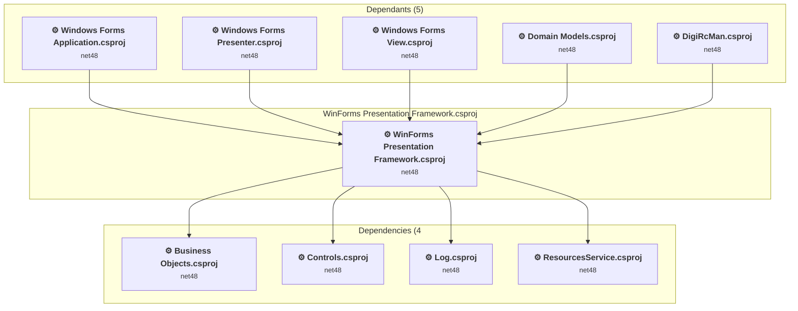

### API Compatibility

| Category | Count | Impact |
| :--- | :---: | :--- |
| 🔴 Binary Incompatible | 396 | High - Require code changes |
| 🟡 Source Incompatible | 125 | Medium - Needs re-compilation and potential conflicting API error fixing |
| 🔵 Behavioral change | 0 | Low - Behavioral changes that may require testing at runtime |
| ✅ Compatible | 1052 |  |
| ***Total APIs Analyzed*** | ***1573*** |  |

#### Project Technologies and Features

| Technology | Issues | Percentage | Migration Path |
| :--- | :---: | :---: | :--- |
| Windows Forms | 396 | 76,0% | Windows Forms APIs for building Windows desktop applications with traditional Forms-based UI that are available in .NET on Windows. Enable Windows Desktop support: Option 1 (Recommended): Target net9.0-windows; Option 2: Add <UseWindowsDesktop>true</UseWindowsDesktop>; Option 3 (Legacy): Use Microsoft.NET.Sdk.WindowsDesktop SDK. |
| GDI+ / System.Drawing | 125 | 24,0% | System.Drawing APIs for 2D graphics, imaging, and printing that are available via NuGet package System.Drawing.Common. Note: Not recommended for server scenarios due to Windows dependencies; consider cross-platform alternatives like SkiaSharp or ImageSharp for new code. |

<a id="raceactionsoundraceactionsoundcsproj"></a>
### RaceActionSound\RaceActionSound.csproj

#### Project Info

- **Current Target Framework:** net48
- **Proposed Target Framework:** net10.0-windows
- **SDK-style**: False
- **Project Kind:** ClassicWinForms
- **Dependencies**: 3
- **Dependants**: 1
- **Number of Files**: 2
- **Number of Files with Incidents**: 2
- **Lines of Code**: 168
- **Estimated LOC to modify**: 2+ (at least 1,2% of the project)

#### Dependency Graph

Legend:
📦 SDK-style project
⚙️ Classic project

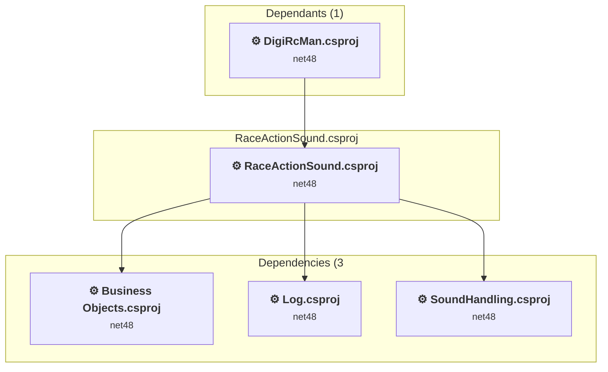

### API Compatibility

| Category | Count | Impact |
| :--- | :---: | :--- |
| 🔴 Binary Incompatible | 2 | High - Require code changes |
| 🟡 Source Incompatible | 0 | Medium - Needs re-compilation and potential conflicting API error fixing |
| 🔵 Behavioral change | 0 | Low - Behavioral changes that may require testing at runtime |
| ✅ Compatible | 126 |  |
| ***Total APIs Analyzed*** | ***128*** |  |

#### Project Technologies and Features

| Technology | Issues | Percentage | Migration Path |
| :--- | :---: | :---: | :--- |
| Windows Forms | 2 | 100,0% | Windows Forms APIs for building Windows desktop applications with traditional Forms-based UI that are available in .NET on Windows. Enable Windows Desktop support: Option 1 (Recommended): Target net9.0-windows; Option 2: Add <UseWindowsDesktop>true</UseWindowsDesktop>; Option 3 (Legacy): Use Microsoft.NET.Sdk.WindowsDesktop SDK. |

<a id="raceactionspeechraceactionspeechcsproj"></a>
### RaceActionSpeech\RaceActionSpeech.csproj

#### Project Info

- **Current Target Framework:** net48
- **Proposed Target Framework:** net10.0
- **SDK-style**: False
- **Project Kind:** ClassicClassLibrary
- **Dependencies**: 3
- **Dependants**: 1
- **Number of Files**: 3
- **Number of Files with Incidents**: 1
- **Lines of Code**: 303
- **Estimated LOC to modify**: 0+ (at least 0,0% of the project)

#### Dependency Graph

Legend:
📦 SDK-style project
⚙️ Classic project

```mermaid
flowchart TB
    subgraph upstream["Dependants (1)"]
        P27["<b>⚙️&nbsp;DigiRcMan.csproj</b><br/><small>net48</small>"]
        click P27 "#digislotmandigircmancsproj"
    end
    subgraph current["RaceActionSpeech.csproj"]
        MAIN["<b>⚙️&nbsp;RaceActionSpeech.csproj</b><br/><small>net48</small>"]
        click MAIN "#raceactionspeechraceactionspeechcsproj"
    end
    subgraph downstream["Dependencies (3"]
        P1["<b>⚙️&nbsp;Business Objects.csproj</b><br/><small>net48</small>"]
        P20["<b>⚙️&nbsp;ComputerSpeech.csproj</b><br/><small>net48</small>"]
        P8["<b>⚙️&nbsp;Log.csproj</b><br/><small>net48</small>"]
        click P1 "#business-objectsbusiness-objectscsproj"
        click P20 "#computerspeechcomputerspeechcsproj"
        click P8 "#loglogcsproj"
    end
    P27 --> MAIN
    MAIN --> P1
    MAIN --> P20
    MAIN --> P8

```

### API Compatibility

| Category | Count | Impact |
| :--- | :---: | :--- |
| 🔴 Binary Incompatible | 0 | High - Require code changes |
| 🟡 Source Incompatible | 0 | Medium - Needs re-compilation and potential conflicting API error fixing |
| 🔵 Behavioral change | 0 | Low - Behavioral changes that may require testing at runtime |
| ✅ Compatible | 244 |  |
| ***Total APIs Analyzed*** | ***244*** |  |

<a id="raceconsolidationserviceraceconsolidationservicecsproj"></a>
### RaceConsolidationService\RaceConsolidationService.csproj

#### Project Info

- **Current Target Framework:** net48
- **Proposed Target Framework:** net10.0
- **SDK-style**: False
- **Project Kind:** ClassicClassLibrary
- **Dependencies**: 3
- **Dependants**: 1
- **Number of Files**: 8
- **Number of Files with Incidents**: 1
- **Lines of Code**: 598
- **Estimated LOC to modify**: 0+ (at least 0,0% of the project)

#### Dependency Graph

Legend:
📦 SDK-style project
⚙️ Classic project

```mermaid
flowchart TB
    subgraph upstream["Dependants (1)"]
        P5["<b>⚙️&nbsp;Windows Forms Application.csproj</b><br/><small>net48</small>"]
        click P5 "#windows-forms-applicationwindows-forms-applicationcsproj"
    end
    subgraph current["RaceConsolidationService.csproj"]
        MAIN["<b>⚙️&nbsp;RaceConsolidationService.csproj</b><br/><small>net48</small>"]
        click MAIN "#raceconsolidationserviceraceconsolidationservicecsproj"
    end
    subgraph downstream["Dependencies (3"]
        P1["<b>⚙️&nbsp;Business Objects.csproj</b><br/><small>net48</small>"]
        P17["<b>⚙️&nbsp;Logger.csproj</b><br/><small>net48</small>"]
        P8["<b>⚙️&nbsp;Log.csproj</b><br/><small>net48</small>"]
        click P1 "#business-objectsbusiness-objectscsproj"
        click P17 "#loggerloggercsproj"
        click P8 "#loglogcsproj"
    end
    P5 --> MAIN
    MAIN --> P1
    MAIN --> P17
    MAIN --> P8

```

### API Compatibility

| Category | Count | Impact |
| :--- | :---: | :--- |
| 🔴 Binary Incompatible | 0 | High - Require code changes |
| 🟡 Source Incompatible | 0 | Medium - Needs re-compilation and potential conflicting API error fixing |
| 🔵 Behavioral change | 0 | Low - Behavioral changes that may require testing at runtime |
| ✅ Compatible | 678 |  |
| ***Total APIs Analyzed*** | ***678*** |  |

<a id="racecontrolserviceracecontrolservicecsproj"></a>
### RaceControlService\RaceControlService.csproj

#### Project Info

- **Current Target Framework:** net48
- **Proposed Target Framework:** net10.0-windows
- **SDK-style**: False
- **Project Kind:** ClassicWinForms
- **Dependencies**: 4
- **Dependants**: 4
- **Number of Files**: 3
- **Number of Files with Incidents**: 3
- **Lines of Code**: 193
- **Estimated LOC to modify**: 3+ (at least 1,6% of the project)

#### Dependency Graph

Legend:
📦 SDK-style project
⚙️ Classic project

```mermaid
flowchart TB
    subgraph upstream["Dependants (4)"]
        P5["<b>⚙️&nbsp;Windows Forms Application.csproj</b><br/><small>net48</small>"]
        P6["<b>⚙️&nbsp;Windows Forms Presenter.csproj</b><br/><small>net48</small>"]
        P19["<b>⚙️&nbsp;MusicPlayer.csproj</b><br/><small>net48</small>"]
        P27["<b>⚙️&nbsp;DigiRcMan.csproj</b><br/><small>net48</small>"]
        click P5 "#windows-forms-applicationwindows-forms-applicationcsproj"
        click P6 "#windows-forms-presenterwindows-forms-presentercsproj"
        click P19 "#musicplayermusicplayercsproj"
        click P27 "#digislotmandigircmancsproj"
    end
    subgraph current["RaceControlService.csproj"]
        MAIN["<b>⚙️&nbsp;RaceControlService.csproj</b><br/><small>net48</small>"]
        click MAIN "#racecontrolserviceracecontrolservicecsproj"
    end
    subgraph downstream["Dependencies (4"]
        P1["<b>⚙️&nbsp;Business Objects.csproj</b><br/><small>net48</small>"]
        P23["<b>⚙️&nbsp;Domain Models.csproj</b><br/><small>net48</small>"]
        P8["<b>⚙️&nbsp;Log.csproj</b><br/><small>net48</small>"]
        P14["<b>⚙️&nbsp;RaceOptionsService.csproj</b><br/><small>net48</small>"]
        click P1 "#business-objectsbusiness-objectscsproj"
        click P23 "#domain-modelsdomain-modelscsproj"
        click P8 "#loglogcsproj"
        click P14 "#raceoptionsserviceraceoptionsservicecsproj"
    end
    P5 --> MAIN
    P6 --> MAIN
    P19 --> MAIN
    P27 --> MAIN
    MAIN --> P1
    MAIN --> P23
    MAIN --> P8
    MAIN --> P14

```

### API Compatibility

| Category | Count | Impact |
| :--- | :---: | :--- |
| 🔴 Binary Incompatible | 3 | High - Require code changes |
| 🟡 Source Incompatible | 0 | Medium - Needs re-compilation and potential conflicting API error fixing |
| 🔵 Behavioral change | 0 | Low - Behavioral changes that may require testing at runtime |
| ✅ Compatible | 524 |  |
| ***Total APIs Analyzed*** | ***527*** |  |

#### Project Technologies and Features

| Technology | Issues | Percentage | Migration Path |
| :--- | :---: | :---: | :--- |
| Windows Forms | 3 | 100,0% | Windows Forms APIs for building Windows desktop applications with traditional Forms-based UI that are available in .NET on Windows. Enable Windows Desktop support: Option 1 (Recommended): Target net9.0-windows; Option 2: Add <UseWindowsDesktop>true</UseWindowsDesktop>; Option 3 (Legacy): Use Microsoft.NET.Sdk.WindowsDesktop SDK. |

<a id="racedataserviceracedataservicecsproj"></a>
### RaceDataService\RaceDataService.csproj

#### Project Info

- **Current Target Framework:** net48
- **Proposed Target Framework:** net10.0
- **SDK-style**: False
- **Project Kind:** ClassicClassLibrary
- **Dependencies**: 3
- **Dependants**: 4
- **Number of Files**: 5
- **Number of Files with Incidents**: 1
- **Lines of Code**: 422
- **Estimated LOC to modify**: 0+ (at least 0,0% of the project)

#### Dependency Graph

Legend:
📦 SDK-style project
⚙️ Classic project

```mermaid
flowchart TB
    subgraph upstream["Dependants (4)"]
        P5["<b>⚙️&nbsp;Windows Forms Application.csproj</b><br/><small>net48</small>"]
        P6["<b>⚙️&nbsp;Windows Forms Presenter.csproj</b><br/><small>net48</small>"]
        P23["<b>⚙️&nbsp;Domain Models.csproj</b><br/><small>net48</small>"]
        P27["<b>⚙️&nbsp;DigiRcMan.csproj</b><br/><small>net48</small>"]
        click P5 "#windows-forms-applicationwindows-forms-applicationcsproj"
        click P6 "#windows-forms-presenterwindows-forms-presentercsproj"
        click P23 "#domain-modelsdomain-modelscsproj"
        click P27 "#digislotmandigircmancsproj"
    end
    subgraph current["RaceDataService.csproj"]
        MAIN["<b>⚙️&nbsp;RaceDataService.csproj</b><br/><small>net48</small>"]
        click MAIN "#racedataserviceracedataservicecsproj"
    end
    subgraph downstream["Dependencies (3"]
        P1["<b>⚙️&nbsp;Business Objects.csproj</b><br/><small>net48</small>"]
        P8["<b>⚙️&nbsp;Log.csproj</b><br/><small>net48</small>"]
        P14["<b>⚙️&nbsp;RaceOptionsService.csproj</b><br/><small>net48</small>"]
        click P1 "#business-objectsbusiness-objectscsproj"
        click P8 "#loglogcsproj"
        click P14 "#raceoptionsserviceraceoptionsservicecsproj"
    end
    P5 --> MAIN
    P6 --> MAIN
    P23 --> MAIN
    P27 --> MAIN
    MAIN --> P1
    MAIN --> P8
    MAIN --> P14

```

### API Compatibility

| Category | Count | Impact |
| :--- | :---: | :--- |
| 🔴 Binary Incompatible | 0 | High - Require code changes |
| 🟡 Source Incompatible | 0 | Medium - Needs re-compilation and potential conflicting API error fixing |
| 🔵 Behavioral change | 0 | Low - Behavioral changes that may require testing at runtime |
| ✅ Compatible | 519 |  |
| ***Total APIs Analyzed*** | ***519*** |  |

<a id="raceoptionsserviceraceoptionsservicecsproj"></a>
### RaceOptionsService\RaceOptionsService.csproj

#### Project Info

- **Current Target Framework:** net48
- **Proposed Target Framework:** net10.0
- **SDK-style**: False
- **Project Kind:** ClassicClassLibrary
- **Dependencies**: 3
- **Dependants**: 9
- **Number of Files**: 10
- **Number of Files with Incidents**: 1
- **Lines of Code**: 509
- **Estimated LOC to modify**: 0+ (at least 0,0% of the project)

#### Dependency Graph

Legend:
📦 SDK-style project
⚙️ Classic project

```mermaid
flowchart TB
    subgraph upstream["Dependants (9)"]
        P5["<b>⚙️&nbsp;Windows Forms Application.csproj</b><br/><small>net48</small>"]
        P6["<b>⚙️&nbsp;Windows Forms Presenter.csproj</b><br/><small>net48</small>"]
        P7["<b>⚙️&nbsp;Windows Forms View.csproj</b><br/><small>net48</small>"]
        P13["<b>⚙️&nbsp;RaceDataService.csproj</b><br/><small>net48</small>"]
        P16["<b>⚙️&nbsp;RaceControlService.csproj</b><br/><small>net48</small>"]
        P17["<b>⚙️&nbsp;Logger.csproj</b><br/><small>net48</small>"]
        P18["<b>⚙️&nbsp;RaceSoundService.csproj</b><br/><small>net48</small>"]
        P23["<b>⚙️&nbsp;Domain Models.csproj</b><br/><small>net48</small>"]
        P27["<b>⚙️&nbsp;DigiRcMan.csproj</b><br/><small>net48</small>"]
        click P5 "#windows-forms-applicationwindows-forms-applicationcsproj"
        click P6 "#windows-forms-presenterwindows-forms-presentercsproj"
        click P7 "#windows-forms-viewwindows-forms-viewcsproj"
        click P13 "#racedataserviceracedataservicecsproj"
        click P16 "#racecontrolserviceracecontrolservicecsproj"
        click P17 "#loggerloggercsproj"
        click P18 "#racesoundserviceracesoundservicecsproj"
        click P23 "#domain-modelsdomain-modelscsproj"
        click P27 "#digislotmandigircmancsproj"
    end
    subgraph current["RaceOptionsService.csproj"]
        MAIN["<b>⚙️&nbsp;RaceOptionsService.csproj</b><br/><small>net48</small>"]
        click MAIN "#raceoptionsserviceraceoptionsservicecsproj"
    end
    subgraph downstream["Dependencies (3"]
        P1["<b>⚙️&nbsp;Business Objects.csproj</b><br/><small>net48</small>"]
        P8["<b>⚙️&nbsp;Log.csproj</b><br/><small>net48</small>"]
        P9["<b>⚙️&nbsp;Serialization.csproj</b><br/><small>net48</small>"]
        click P1 "#business-objectsbusiness-objectscsproj"
        click P8 "#loglogcsproj"
        click P9 "#serializationserializationcsproj"
    end
    P5 --> MAIN
    P6 --> MAIN
    P7 --> MAIN
    P13 --> MAIN
    P16 --> MAIN
    P17 --> MAIN
    P18 --> MAIN
    P23 --> MAIN
    P27 --> MAIN
    MAIN --> P1
    MAIN --> P8
    MAIN --> P9

```

### API Compatibility

| Category | Count | Impact |
| :--- | :---: | :--- |
| 🔴 Binary Incompatible | 0 | High - Require code changes |
| 🟡 Source Incompatible | 0 | Medium - Needs re-compilation and potential conflicting API error fixing |
| 🔵 Behavioral change | 0 | Low - Behavioral changes that may require testing at runtime |
| ✅ Compatible | 323 |  |
| ***Total APIs Analyzed*** | ***323*** |  |

<a id="racesoundracesoundcsproj"></a>
### RaceSound\RaceSound.csproj

#### Project Info

- **Current Target Framework:** net48
- **Proposed Target Framework:** net10.0-windows
- **SDK-style**: False
- **Project Kind:** ClassicWinForms
- **Dependencies**: 4
- **Dependants**: 1
- **Number of Files**: 3
- **Number of Files with Incidents**: 3
- **Lines of Code**: 372
- **Estimated LOC to modify**: 4+ (at least 1,1% of the project)

#### Dependency Graph

Legend:
📦 SDK-style project
⚙️ Classic project

```mermaid
flowchart TB
    subgraph upstream["Dependants (1)"]
        P18["<b>⚙️&nbsp;RaceSoundService.csproj</b><br/><small>net48</small>"]
        click P18 "#racesoundserviceracesoundservicecsproj"
    end
    subgraph current["RaceSound.csproj"]
        MAIN["<b>⚙️&nbsp;RaceSound.csproj</b><br/><small>net48</small>"]
        click MAIN "#racesoundracesoundcsproj"
    end
    subgraph downstream["Dependencies (4"]
        P1["<b>⚙️&nbsp;Business Objects.csproj</b><br/><small>net48</small>"]
        P15["<b>⚙️&nbsp;HelperClasses.csproj</b><br/><small>net48</small>"]
        P8["<b>⚙️&nbsp;Log.csproj</b><br/><small>net48</small>"]
        P22["<b>⚙️&nbsp;ResourcesService.csproj</b><br/><small>net48</small>"]
        click P1 "#business-objectsbusiness-objectscsproj"
        click P15 "#helperclasseshelperclassescsproj"
        click P8 "#loglogcsproj"
        click P22 "#resourcesserviceresourcesservicecsproj"
    end
    P18 --> MAIN
    MAIN --> P1
    MAIN --> P15
    MAIN --> P8
    MAIN --> P22

```

### API Compatibility

| Category | Count | Impact |
| :--- | :---: | :--- |
| 🔴 Binary Incompatible | 4 | High - Require code changes |
| 🟡 Source Incompatible | 0 | Medium - Needs re-compilation and potential conflicting API error fixing |
| 🔵 Behavioral change | 0 | Low - Behavioral changes that may require testing at runtime |
| ✅ Compatible | 312 |  |
| ***Total APIs Analyzed*** | ***316*** |  |

#### Project Technologies and Features

| Technology | Issues | Percentage | Migration Path |
| :--- | :---: | :---: | :--- |
| Windows Forms | 4 | 100,0% | Windows Forms APIs for building Windows desktop applications with traditional Forms-based UI that are available in .NET on Windows. Enable Windows Desktop support: Option 1 (Recommended): Target net9.0-windows; Option 2: Add <UseWindowsDesktop>true</UseWindowsDesktop>; Option 3 (Legacy): Use Microsoft.NET.Sdk.WindowsDesktop SDK. |

<a id="racesoundserviceracesoundservicecsproj"></a>
### RaceSoundService\RaceSoundService.csproj

#### Project Info

- **Current Target Framework:** net48
- **Proposed Target Framework:** net10.0-windows
- **SDK-style**: False
- **Project Kind:** ClassicWinForms
- **Dependencies**: 6
- **Dependants**: 1
- **Number of Files**: 5
- **Number of Files with Incidents**: 2
- **Lines of Code**: 770
- **Estimated LOC to modify**: 10+ (at least 1,3% of the project)

#### Dependency Graph

Legend:
📦 SDK-style project
⚙️ Classic project

```mermaid
flowchart TB
    subgraph upstream["Dependants (1)"]
        P19["<b>⚙️&nbsp;MusicPlayer.csproj</b><br/><small>net48</small>"]
        click P19 "#musicplayermusicplayercsproj"
    end
    subgraph current["RaceSoundService.csproj"]
        MAIN["<b>⚙️&nbsp;RaceSoundService.csproj</b><br/><small>net48</small>"]
        click MAIN "#racesoundserviceracesoundservicecsproj"
    end
    subgraph downstream["Dependencies (6"]
        P1["<b>⚙️&nbsp;Business Objects.csproj</b><br/><small>net48</small>"]
        P15["<b>⚙️&nbsp;HelperClasses.csproj</b><br/><small>net48</small>"]
        P8["<b>⚙️&nbsp;Log.csproj</b><br/><small>net48</small>"]
        P14["<b>⚙️&nbsp;RaceOptionsService.csproj</b><br/><small>net48</small>"]
        P12["<b>⚙️&nbsp;RaceSound.csproj</b><br/><small>net48</small>"]
        P22["<b>⚙️&nbsp;ResourcesService.csproj</b><br/><small>net48</small>"]
        click P1 "#business-objectsbusiness-objectscsproj"
        click P15 "#helperclasseshelperclassescsproj"
        click P8 "#loglogcsproj"
        click P14 "#raceoptionsserviceraceoptionsservicecsproj"
        click P12 "#racesoundracesoundcsproj"
        click P22 "#resourcesserviceresourcesservicecsproj"
    end
    P19 --> MAIN
    MAIN --> P1
    MAIN --> P15
    MAIN --> P8
    MAIN --> P14
    MAIN --> P12
    MAIN --> P22

```

### API Compatibility

| Category | Count | Impact |
| :--- | :---: | :--- |
| 🔴 Binary Incompatible | 10 | High - Require code changes |
| 🟡 Source Incompatible | 0 | Medium - Needs re-compilation and potential conflicting API error fixing |
| 🔵 Behavioral change | 0 | Low - Behavioral changes that may require testing at runtime |
| ✅ Compatible | 648 |  |
| ***Total APIs Analyzed*** | ***658*** |  |

#### Project Technologies and Features

| Technology | Issues | Percentage | Migration Path |
| :--- | :---: | :---: | :--- |
| Windows Forms | 10 | 100,0% | Windows Forms APIs for building Windows desktop applications with traditional Forms-based UI that are available in .NET on Windows. Enable Windows Desktop support: Option 1 (Recommended): Target net9.0-windows; Option 2: Add <UseWindowsDesktop>true</UseWindowsDesktop>; Option 3 (Legacy): Use Microsoft.NET.Sdk.WindowsDesktop SDK. |

<a id="racestatisticsserviceracestatisticsservicecsproj"></a>
### RaceStatisticsService\RaceStatisticsService.csproj

#### Project Info

- **Current Target Framework:** net48
- **Proposed Target Framework:** net10.0
- **SDK-style**: False
- **Project Kind:** ClassicClassLibrary
- **Dependencies**: 3
- **Dependants**: 4
- **Number of Files**: 5
- **Number of Files with Incidents**: 3
- **Lines of Code**: 293
- **Estimated LOC to modify**: 2+ (at least 0,7% of the project)

#### Dependency Graph

Legend:
📦 SDK-style project
⚙️ Classic project

```mermaid
flowchart TB
    subgraph upstream["Dependants (4)"]
        P5["<b>⚙️&nbsp;Windows Forms Application.csproj</b><br/><small>net48</small>"]
        P6["<b>⚙️&nbsp;Windows Forms Presenter.csproj</b><br/><small>net48</small>"]
        P23["<b>⚙️&nbsp;Domain Models.csproj</b><br/><small>net48</small>"]
        P27["<b>⚙️&nbsp;DigiRcMan.csproj</b><br/><small>net48</small>"]
        click P5 "#windows-forms-applicationwindows-forms-applicationcsproj"
        click P6 "#windows-forms-presenterwindows-forms-presentercsproj"
        click P23 "#domain-modelsdomain-modelscsproj"
        click P27 "#digislotmandigircmancsproj"
    end
    subgraph current["RaceStatisticsService.csproj"]
        MAIN["<b>⚙️&nbsp;RaceStatisticsService.csproj</b><br/><small>net48</small>"]
        click MAIN "#racestatisticsserviceracestatisticsservicecsproj"
    end
    subgraph downstream["Dependencies (3"]
        P1["<b>⚙️&nbsp;Business Objects.csproj</b><br/><small>net48</small>"]
        P17["<b>⚙️&nbsp;Logger.csproj</b><br/><small>net48</small>"]
        P8["<b>⚙️&nbsp;Log.csproj</b><br/><small>net48</small>"]
        click P1 "#business-objectsbusiness-objectscsproj"
        click P17 "#loggerloggercsproj"
        click P8 "#loglogcsproj"
    end
    P5 --> MAIN
    P6 --> MAIN
    P23 --> MAIN
    P27 --> MAIN
    MAIN --> P1
    MAIN --> P17
    MAIN --> P8

```

### API Compatibility

| Category | Count | Impact |
| :--- | :---: | :--- |
| 🔴 Binary Incompatible | 0 | High - Require code changes |
| 🟡 Source Incompatible | 0 | Medium - Needs re-compilation and potential conflicting API error fixing |
| 🔵 Behavioral change | 2 | Low - Behavioral changes that may require testing at runtime |
| ✅ Compatible | 261 |  |
| ***Total APIs Analyzed*** | ***263*** |  |

<a id="resourcesserviceresourcesservicecsproj"></a>
### ResourcesService\ResourcesService.csproj

#### Project Info

- **Current Target Framework:** net48
- **Proposed Target Framework:** net10.0-windows
- **SDK-style**: False
- **Project Kind:** ClassicWinForms
- **Dependencies**: 2
- **Dependants**: 8
- **Number of Files**: 7
- **Number of Files with Incidents**: 2
- **Lines of Code**: 3589
- **Estimated LOC to modify**: 5+ (at least 0,1% of the project)

#### Dependency Graph

Legend:
📦 SDK-style project
⚙️ Classic project

```mermaid
flowchart TB
    subgraph upstream["Dependants (8)"]
        P1["<b>⚙️&nbsp;Business Objects.csproj</b><br/><small>net48</small>"]
        P4["<b>⚙️&nbsp;WinForms Presentation Framework.csproj</b><br/><small>net48</small>"]
        P5["<b>⚙️&nbsp;Windows Forms Application.csproj</b><br/><small>net48</small>"]
        P6["<b>⚙️&nbsp;Windows Forms Presenter.csproj</b><br/><small>net48</small>"]
        P12["<b>⚙️&nbsp;RaceSound.csproj</b><br/><small>net48</small>"]
        P18["<b>⚙️&nbsp;RaceSoundService.csproj</b><br/><small>net48</small>"]
        P23["<b>⚙️&nbsp;Domain Models.csproj</b><br/><small>net48</small>"]
        P27["<b>⚙️&nbsp;DigiRcMan.csproj</b><br/><small>net48</small>"]
        click P1 "#business-objectsbusiness-objectscsproj"
        click P4 "#presentation-frameworkwinforms-presentation-frameworkcsproj"
        click P5 "#windows-forms-applicationwindows-forms-applicationcsproj"
        click P6 "#windows-forms-presenterwindows-forms-presentercsproj"
        click P12 "#racesoundracesoundcsproj"
        click P18 "#racesoundserviceracesoundservicecsproj"
        click P23 "#domain-modelsdomain-modelscsproj"
        click P27 "#digislotmandigircmancsproj"
    end
    subgraph current["ResourcesService.csproj"]
        MAIN["<b>⚙️&nbsp;ResourcesService.csproj</b><br/><small>net48</small>"]
        click MAIN "#resourcesserviceresourcesservicecsproj"
    end
    subgraph downstream["Dependencies (2"]
        P3["<b>⚙️&nbsp;Exceptions.csproj</b><br/><small>net48</small>"]
        P8["<b>⚙️&nbsp;Log.csproj</b><br/><small>net48</small>"]
        click P3 "#exceptionsexceptionscsproj"
        click P8 "#loglogcsproj"
    end
    P1 --> MAIN
    P4 --> MAIN
    P5 --> MAIN
    P6 --> MAIN
    P12 --> MAIN
    P18 --> MAIN
    P23 --> MAIN
    P27 --> MAIN
    MAIN --> P3
    MAIN --> P8

```

### API Compatibility

| Category | Count | Impact |
| :--- | :---: | :--- |
| 🔴 Binary Incompatible | 5 | High - Require code changes |
| 🟡 Source Incompatible | 0 | Medium - Needs re-compilation and potential conflicting API error fixing |
| 🔵 Behavioral change | 0 | Low - Behavioral changes that may require testing at runtime |
| ✅ Compatible | 2376 |  |
| ***Total APIs Analyzed*** | ***2381*** |  |

#### Project Technologies and Features

| Technology | Issues | Percentage | Migration Path |
| :--- | :---: | :---: | :--- |
| Windows Forms | 2 | 40,0% | Windows Forms APIs for building Windows desktop applications with traditional Forms-based UI that are available in .NET on Windows. Enable Windows Desktop support: Option 1 (Recommended): Target net9.0-windows; Option 2: Add <UseWindowsDesktop>true</UseWindowsDesktop>; Option 3 (Legacy): Use Microsoft.NET.Sdk.WindowsDesktop SDK. |

<a id="serializationserializationcsproj"></a>
### Serialization\Serialization.csproj

#### Project Info

- **Current Target Framework:** net48
- **Proposed Target Framework:** net10.0
- **SDK-style**: False
- **Project Kind:** ClassicClassLibrary
- **Dependencies**: 0
- **Dependants**: 2
- **Number of Files**: 2
- **Number of Files with Incidents**: 2
- **Lines of Code**: 245
- **Estimated LOC to modify**: 7+ (at least 2,9% of the project)

#### Dependency Graph

Legend:
📦 SDK-style project
⚙️ Classic project

```mermaid
flowchart TB
    subgraph upstream["Dependants (2)"]
        P6["<b>⚙️&nbsp;Windows Forms Presenter.csproj</b><br/><small>net48</small>"]
        P14["<b>⚙️&nbsp;RaceOptionsService.csproj</b><br/><small>net48</small>"]
        click P6 "#windows-forms-presenterwindows-forms-presentercsproj"
        click P14 "#raceoptionsserviceraceoptionsservicecsproj"
    end
    subgraph current["Serialization.csproj"]
        MAIN["<b>⚙️&nbsp;Serialization.csproj</b><br/><small>net48</small>"]
        click MAIN "#serializationserializationcsproj"
    end
    P6 --> MAIN
    P14 --> MAIN

```

### API Compatibility

| Category | Count | Impact |
| :--- | :---: | :--- |
| 🔴 Binary Incompatible | 0 | High - Require code changes |
| 🟡 Source Incompatible | 2 | Medium - Needs re-compilation and potential conflicting API error fixing |
| 🔵 Behavioral change | 5 | Low - Behavioral changes that may require testing at runtime |
| ✅ Compatible | 95 |  |
| ***Total APIs Analyzed*** | ***102*** |  |

#### Project Technologies and Features

| Technology | Issues | Percentage | Migration Path |
| :--- | :---: | :---: | :--- |
| Deprecated Remoting & Serialization | 2 | 28,6% | Legacy .NET Remoting, BinaryFormatter, and related serialization APIs that are deprecated and removed for security reasons. Remoting provided distributed object communication but had significant security vulnerabilities. Migrate to gRPC, HTTP APIs, or modern serialization (System.Text.Json, protobuf). |

<a id="serialportreaderserialportreadercsproj"></a>
### SerialPortReader\SerialPortReader.csproj

#### Project Info

- **Current Target Framework:** net48
- **Proposed Target Framework:** net10.0
- **SDK-style**: False
- **Project Kind:** ClassicClassLibrary
- **Dependencies**: 2
- **Dependants**: 1
- **Number of Files**: 5
- **Number of Files with Incidents**: 4
- **Lines of Code**: 529
- **Estimated LOC to modify**: 67+ (at least 12,7% of the project)

#### Dependency Graph

Legend:
📦 SDK-style project
⚙️ Classic project

```mermaid
flowchart TB
    subgraph upstream["Dependants (1)"]
        P27["<b>⚙️&nbsp;DigiRcMan.csproj</b><br/><small>net48</small>"]
        click P27 "#digislotmandigircmancsproj"
    end
    subgraph current["SerialPortReader.csproj"]
        MAIN["<b>⚙️&nbsp;SerialPortReader.csproj</b><br/><small>net48</small>"]
        click MAIN "#serialportreaderserialportreadercsproj"
    end
    subgraph downstream["Dependencies (2"]
        P1["<b>⚙️&nbsp;Business Objects.csproj</b><br/><small>net48</small>"]
        P8["<b>⚙️&nbsp;Log.csproj</b><br/><small>net48</small>"]
        click P1 "#business-objectsbusiness-objectscsproj"
        click P8 "#loglogcsproj"
    end
    P27 --> MAIN
    MAIN --> P1
    MAIN --> P8

```

### API Compatibility

| Category | Count | Impact |
| :--- | :---: | :--- |
| 🔴 Binary Incompatible | 0 | High - Require code changes |
| 🟡 Source Incompatible | 67 | Medium - Needs re-compilation and potential conflicting API error fixing |
| 🔵 Behavioral change | 0 | Low - Behavioral changes that may require testing at runtime |
| ✅ Compatible | 447 |  |
| ***Total APIs Analyzed*** | ***514*** |  |

<a id="soundhandlingsoundhandlingcsproj"></a>
### SoundHandling\SoundHandling.csproj

#### Project Info

- **Current Target Framework:** net48
- **Proposed Target Framework:** net10.0
- **SDK-style**: False
- **Project Kind:** ClassicClassLibrary
- **Dependencies**: 1
- **Dependants**: 1
- **Number of Files**: 2
- **Number of Files with Incidents**: 1
- **Lines of Code**: 68
- **Estimated LOC to modify**: 0+ (at least 0,0% of the project)

#### Dependency Graph

Legend:
📦 SDK-style project
⚙️ Classic project

```mermaid
flowchart TB
    subgraph upstream["Dependants (1)"]
        P21["<b>⚙️&nbsp;RaceActionSound.csproj</b><br/><small>net48</small>"]
        click P21 "#raceactionsoundraceactionsoundcsproj"
    end
    subgraph current["SoundHandling.csproj"]
        MAIN["<b>⚙️&nbsp;SoundHandling.csproj</b><br/><small>net48</small>"]
        click MAIN "#soundhandlingsoundhandlingcsproj"
    end
    subgraph downstream["Dependencies (1"]
        P8["<b>⚙️&nbsp;Log.csproj</b><br/><small>net48</small>"]
        click P8 "#loglogcsproj"
    end
    P21 --> MAIN
    MAIN --> P8

```

### API Compatibility

| Category | Count | Impact |
| :--- | :---: | :--- |
| 🔴 Binary Incompatible | 0 | High - Require code changes |
| 🟡 Source Incompatible | 0 | Medium - Needs re-compilation and potential conflicting API error fixing |
| 🔵 Behavioral change | 0 | Low - Behavioral changes that may require testing at runtime |
| ✅ Compatible | 25 |  |
| ***Total APIs Analyzed*** | ***25*** |  |

<a id="windows-forms-applicationwindows-forms-applicationcsproj"></a>
### Windows Forms Application\Windows Forms Application.csproj

#### Project Info

- **Current Target Framework:** net48
- **Proposed Target Framework:** net10.0-windows
- **SDK-style**: False
- **Project Kind:** ClassicWpf
- **Dependencies**: 17
- **Dependants**: 1
- **Number of Files**: 368
- **Number of Files with Incidents**: 68
- **Lines of Code**: 20339
- **Estimated LOC to modify**: 29351+ (at least 144,3% of the project)

#### Dependency Graph

Legend:
📦 SDK-style project
⚙️ Classic project

```mermaid
flowchart TB
    subgraph upstream["Dependants (1)"]
        P27["<b>⚙️&nbsp;DigiRcMan.csproj</b><br/><small>net48</small>"]
        click P27 "#digislotmandigircmancsproj"
    end
    subgraph current["Windows Forms Application.csproj"]
        MAIN["<b>⚙️&nbsp;Windows Forms Application.csproj</b><br/><small>net48</small>"]
        click MAIN "#windows-forms-applicationwindows-forms-applicationcsproj"
    end
    subgraph downstream["Dependencies (17"]
        P1["<b>⚙️&nbsp;Business Objects.csproj</b><br/><small>net48</small>"]
        P30["<b>⚙️&nbsp;BusinessObjectContracts.csproj</b><br/><small>net48</small>"]
        P20["<b>⚙️&nbsp;ComputerSpeech.csproj</b><br/><small>net48</small>"]
        P10["<b>⚙️&nbsp;Controls.csproj</b><br/><small>net48</small>"]
        P23["<b>⚙️&nbsp;Domain Models.csproj</b><br/><small>net48</small>"]
        P15["<b>⚙️&nbsp;HelperClasses.csproj</b><br/><small>net48</small>"]
        P17["<b>⚙️&nbsp;Logger.csproj</b><br/><small>net48</small>"]
        P8["<b>⚙️&nbsp;Log.csproj</b><br/><small>net48</small>"]
        P4["<b>⚙️&nbsp;WinForms Presentation Framework.csproj</b><br/><small>net48</small>"]
        P26["<b>⚙️&nbsp;RaceConsolidationService.csproj</b><br/><small>net48</small>"]
        P16["<b>⚙️&nbsp;RaceControlService.csproj</b><br/><small>net48</small>"]
        P13["<b>⚙️&nbsp;RaceDataService.csproj</b><br/><small>net48</small>"]
        P14["<b>⚙️&nbsp;RaceOptionsService.csproj</b><br/><small>net48</small>"]
        P24["<b>⚙️&nbsp;RaceStatisticsService.csproj</b><br/><small>net48</small>"]
        P22["<b>⚙️&nbsp;ResourcesService.csproj</b><br/><small>net48</small>"]
        P6["<b>⚙️&nbsp;Windows Forms Presenter.csproj</b><br/><small>net48</small>"]
        P7["<b>⚙️&nbsp;Windows Forms View.csproj</b><br/><small>net48</small>"]
        click P1 "#business-objectsbusiness-objectscsproj"
        click P30 "#businessobjectcontractsbusinessobjectcontractscsproj"
        click P20 "#computerspeechcomputerspeechcsproj"
        click P10 "#controlscontrolscsproj"
        click P23 "#domain-modelsdomain-modelscsproj"
        click P15 "#helperclasseshelperclassescsproj"
        click P17 "#loggerloggercsproj"
        click P8 "#loglogcsproj"
        click P4 "#presentation-frameworkwinforms-presentation-frameworkcsproj"
        click P26 "#raceconsolidationserviceraceconsolidationservicecsproj"
        click P16 "#racecontrolserviceracecontrolservicecsproj"
        click P13 "#racedataserviceracedataservicecsproj"
        click P14 "#raceoptionsserviceraceoptionsservicecsproj"
        click P24 "#racestatisticsserviceracestatisticsservicecsproj"
        click P22 "#resourcesserviceresourcesservicecsproj"
        click P6 "#windows-forms-presenterwindows-forms-presentercsproj"
        click P7 "#windows-forms-viewwindows-forms-viewcsproj"
    end
    P27 --> MAIN
    MAIN --> P1
    MAIN --> P30
    MAIN --> P20
    MAIN --> P10
    MAIN --> P23
    MAIN --> P15
    MAIN --> P17
    MAIN --> P8
    MAIN --> P4
    MAIN --> P26
    MAIN --> P16
    MAIN --> P13
    MAIN --> P14
    MAIN --> P24
    MAIN --> P22
    MAIN --> P6
    MAIN --> P7

```

### API Compatibility

| Category | Count | Impact |
| :--- | :---: | :--- |
| 🔴 Binary Incompatible | 24898 | High - Require code changes |
| 🟡 Source Incompatible | 4453 | Medium - Needs re-compilation and potential conflicting API error fixing |
| 🔵 Behavioral change | 0 | Low - Behavioral changes that may require testing at runtime |
| ✅ Compatible | 24654 |  |
| ***Total APIs Analyzed*** | ***54005*** |  |

#### Project Technologies and Features

| Technology | Issues | Percentage | Migration Path |
| :--- | :---: | :---: | :--- |
| Windows Forms Legacy Controls | 4147 | 14,1% | Legacy Windows Forms controls that have been removed from .NET Core/5+ including StatusBar, DataGrid, ContextMenu, MainMenu, MenuItem, and ToolBar. These controls were replaced by more modern alternatives. Use ToolStrip, MenuStrip, ContextMenuStrip, and DataGridView instead. |
| Windows Forms | 25024 | 85,3% | Windows Forms APIs for building Windows desktop applications with traditional Forms-based UI that are available in .NET on Windows. Enable Windows Desktop support: Option 1 (Recommended): Target net9.0-windows; Option 2: Add <UseWindowsDesktop>true</UseWindowsDesktop>; Option 3 (Legacy): Use Microsoft.NET.Sdk.WindowsDesktop SDK. |
| GDI+ / System.Drawing | 4327 | 14,7% | System.Drawing APIs for 2D graphics, imaging, and printing that are available via NuGet package System.Drawing.Common. Note: Not recommended for server scenarios due to Windows dependencies; consider cross-platform alternatives like SkiaSharp or ImageSharp for new code. |

<a id="windows-forms-presenterwindows-forms-presentercsproj"></a>
### Windows Forms Presenter\Windows Forms Presenter.csproj

#### Project Info

- **Current Target Framework:** net48
- **Proposed Target Framework:** net10.0-windows
- **SDK-style**: False
- **Project Kind:** ClassicWpf
- **Dependencies**: 15
- **Dependants**: 2
- **Number of Files**: 53
- **Number of Files with Incidents**: 30
- **Lines of Code**: 8256
- **Estimated LOC to modify**: 2062+ (at least 25,0% of the project)

#### Dependency Graph

Legend:
📦 SDK-style project
⚙️ Classic project

```mermaid
flowchart TB
    subgraph upstream["Dependants (2)"]
        P5["<b>⚙️&nbsp;Windows Forms Application.csproj</b><br/><small>net48</small>"]
        P27["<b>⚙️&nbsp;DigiRcMan.csproj</b><br/><small>net48</small>"]
        click P5 "#windows-forms-applicationwindows-forms-applicationcsproj"
        click P27 "#digislotmandigircmancsproj"
    end
    subgraph current["Windows Forms Presenter.csproj"]
        MAIN["<b>⚙️&nbsp;Windows Forms Presenter.csproj</b><br/><small>net48</small>"]
        click MAIN "#windows-forms-presenterwindows-forms-presentercsproj"
    end
    subgraph downstream["Dependencies (15"]
        P1["<b>⚙️&nbsp;Business Objects.csproj</b><br/><small>net48</small>"]
        P10["<b>⚙️&nbsp;Controls.csproj</b><br/><small>net48</small>"]
        P23["<b>⚙️&nbsp;Domain Models.csproj</b><br/><small>net48</small>"]
        P3["<b>⚙️&nbsp;Exceptions.csproj</b><br/><small>net48</small>"]
        P15["<b>⚙️&nbsp;HelperClasses.csproj</b><br/><small>net48</small>"]
        P17["<b>⚙️&nbsp;Logger.csproj</b><br/><small>net48</small>"]
        P8["<b>⚙️&nbsp;Log.csproj</b><br/><small>net48</small>"]
        P4["<b>⚙️&nbsp;WinForms Presentation Framework.csproj</b><br/><small>net48</small>"]
        P16["<b>⚙️&nbsp;RaceControlService.csproj</b><br/><small>net48</small>"]
        P13["<b>⚙️&nbsp;RaceDataService.csproj</b><br/><small>net48</small>"]
        P14["<b>⚙️&nbsp;RaceOptionsService.csproj</b><br/><small>net48</small>"]
        P24["<b>⚙️&nbsp;RaceStatisticsService.csproj</b><br/><small>net48</small>"]
        P22["<b>⚙️&nbsp;ResourcesService.csproj</b><br/><small>net48</small>"]
        P9["<b>⚙️&nbsp;Serialization.csproj</b><br/><small>net48</small>"]
        P7["<b>⚙️&nbsp;Windows Forms View.csproj</b><br/><small>net48</small>"]
        click P1 "#business-objectsbusiness-objectscsproj"
        click P10 "#controlscontrolscsproj"
        click P23 "#domain-modelsdomain-modelscsproj"
        click P3 "#exceptionsexceptionscsproj"
        click P15 "#helperclasseshelperclassescsproj"
        click P17 "#loggerloggercsproj"
        click P8 "#loglogcsproj"
        click P4 "#presentation-frameworkwinforms-presentation-frameworkcsproj"
        click P16 "#racecontrolserviceracecontrolservicecsproj"
        click P13 "#racedataserviceracedataservicecsproj"
        click P14 "#raceoptionsserviceraceoptionsservicecsproj"
        click P24 "#racestatisticsserviceracestatisticsservicecsproj"
        click P22 "#resourcesserviceresourcesservicecsproj"
        click P9 "#serializationserializationcsproj"
        click P7 "#windows-forms-viewwindows-forms-viewcsproj"
    end
    P5 --> MAIN
    P27 --> MAIN
    MAIN --> P1
    MAIN --> P10
    MAIN --> P23
    MAIN --> P3
    MAIN --> P15
    MAIN --> P17
    MAIN --> P8
    MAIN --> P4
    MAIN --> P16
    MAIN --> P13
    MAIN --> P14
    MAIN --> P24
    MAIN --> P22
    MAIN --> P9
    MAIN --> P7

```

### API Compatibility

| Category | Count | Impact |
| :--- | :---: | :--- |
| 🔴 Binary Incompatible | 1822 | High - Require code changes |
| 🟡 Source Incompatible | 240 | Medium - Needs re-compilation and potential conflicting API error fixing |
| 🔵 Behavioral change | 0 | Low - Behavioral changes that may require testing at runtime |
| ✅ Compatible | 11774 |  |
| ***Total APIs Analyzed*** | ***13836*** |  |

#### Project Technologies and Features

| Technology | Issues | Percentage | Migration Path |
| :--- | :---: | :---: | :--- |
| Windows Forms Legacy Controls | 1075 | 52,1% | Legacy Windows Forms controls that have been removed from .NET Core/5+ including StatusBar, DataGrid, ContextMenu, MainMenu, MenuItem, and ToolBar. These controls were replaced by more modern alternatives. Use ToolStrip, MenuStrip, ContextMenuStrip, and DataGridView instead. |
| GDI+ / System.Drawing | 240 | 11,6% | System.Drawing APIs for 2D graphics, imaging, and printing that are available via NuGet package System.Drawing.Common. Note: Not recommended for server scenarios due to Windows dependencies; consider cross-platform alternatives like SkiaSharp or ImageSharp for new code. |
| Windows Forms | 1820 | 88,3% | Windows Forms APIs for building Windows desktop applications with traditional Forms-based UI that are available in .NET on Windows. Enable Windows Desktop support: Option 1 (Recommended): Target net9.0-windows; Option 2: Add <UseWindowsDesktop>true</UseWindowsDesktop>; Option 3 (Legacy): Use Microsoft.NET.Sdk.WindowsDesktop SDK. |

<a id="windows-forms-viewwindows-forms-viewcsproj"></a>
### Windows Forms View\Windows Forms View.csproj

#### Project Info

- **Current Target Framework:** net48
- **Proposed Target Framework:** net10.0-windows
- **SDK-style**: False
- **Project Kind:** ClassicWinForms
- **Dependencies**: 4
- **Dependants**: 3
- **Number of Files**: 28
- **Number of Files with Incidents**: 19
- **Lines of Code**: 538
- **Estimated LOC to modify**: 354+ (at least 65,8% of the project)

#### Dependency Graph

Legend:
📦 SDK-style project
⚙️ Classic project

```mermaid
flowchart TB
    subgraph upstream["Dependants (3)"]
        P5["<b>⚙️&nbsp;Windows Forms Application.csproj</b><br/><small>net48</small>"]
        P6["<b>⚙️&nbsp;Windows Forms Presenter.csproj</b><br/><small>net48</small>"]
        P27["<b>⚙️&nbsp;DigiRcMan.csproj</b><br/><small>net48</small>"]
        click P5 "#windows-forms-applicationwindows-forms-applicationcsproj"
        click P6 "#windows-forms-presenterwindows-forms-presentercsproj"
        click P27 "#digislotmandigircmancsproj"
    end
    subgraph current["Windows Forms View.csproj"]
        MAIN["<b>⚙️&nbsp;Windows Forms View.csproj</b><br/><small>net48</small>"]
        click MAIN "#windows-forms-viewwindows-forms-viewcsproj"
    end
    subgraph downstream["Dependencies (4"]
        P1["<b>⚙️&nbsp;Business Objects.csproj</b><br/><small>net48</small>"]
        P10["<b>⚙️&nbsp;Controls.csproj</b><br/><small>net48</small>"]
        P4["<b>⚙️&nbsp;WinForms Presentation Framework.csproj</b><br/><small>net48</small>"]
        P14["<b>⚙️&nbsp;RaceOptionsService.csproj</b><br/><small>net48</small>"]
        click P1 "#business-objectsbusiness-objectscsproj"
        click P10 "#controlscontrolscsproj"
        click P4 "#presentation-frameworkwinforms-presentation-frameworkcsproj"
        click P14 "#raceoptionsserviceraceoptionsservicecsproj"
    end
    P5 --> MAIN
    P6 --> MAIN
    P27 --> MAIN
    MAIN --> P1
    MAIN --> P10
    MAIN --> P4
    MAIN --> P14

```

### API Compatibility

| Category | Count | Impact |
| :--- | :---: | :--- |
| 🔴 Binary Incompatible | 351 | High - Require code changes |
| 🟡 Source Incompatible | 3 | Medium - Needs re-compilation and potential conflicting API error fixing |
| 🔵 Behavioral change | 0 | Low - Behavioral changes that may require testing at runtime |
| ✅ Compatible | 578 |  |
| ***Total APIs Analyzed*** | ***932*** |  |

#### Project Technologies and Features

| Technology | Issues | Percentage | Migration Path |
| :--- | :---: | :---: | :--- |
| GDI+ / System.Drawing | 3 | 0,8% | System.Drawing APIs for 2D graphics, imaging, and printing that are available via NuGet package System.Drawing.Common. Note: Not recommended for server scenarios due to Windows dependencies; consider cross-platform alternatives like SkiaSharp or ImageSharp for new code. |
| Windows Forms Legacy Controls | 70 | 19,8% | Legacy Windows Forms controls that have been removed from .NET Core/5+ including StatusBar, DataGrid, ContextMenu, MainMenu, MenuItem, and ToolBar. These controls were replaced by more modern alternatives. Use ToolStrip, MenuStrip, ContextMenuStrip, and DataGridView instead. |
| Windows Forms | 351 | 99,2% | Windows Forms APIs for building Windows desktop applications with traditional Forms-based UI that are available in .NET on Windows. Enable Windows Desktop support: Option 1 (Recommended): Target net9.0-windows; Option 2: Add <UseWindowsDesktop>true</UseWindowsDesktop>; Option 3 (Legacy): Use Microsoft.NET.Sdk.WindowsDesktop SDK. |

